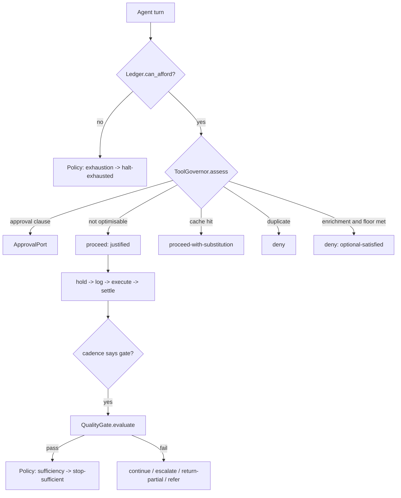

# OutcomeFuse — How every feature works

How each mechanism decides, how a tool call is **justified**, how a result is
**verified**, and what is written down so the claim can be checked afterwards.

This document describes the code as it is, including the places where a feature
is a `gap` or a `defect`. `clients/features/report.py` computes those statuses
from live runs; nothing in this document is a claim the code does not make.

---

## 0. The one-paragraph model

An agent proposes a step. The **Driver** asks the **Ledger** whether it is
affordable, asks the **Tool Governor** whether it is justified, appends the
decision to an **append-only log**, and only then lets the step happen. When the
agent produces an answer, the **Quality Gate** scores it against a declared
**Outcome Contract** using a **closed registry of deterministic verifiers**. The
**Policy** converts every terminating or blocking condition into one recorded
triple — `decision_reason` / `policy_action` / `terminal_reason` — under a fixed
precedence ladder. Everything else in the repository exists to make the
resulting number falsifiable.



---

## 1. The Outcome Contract

**Files** — [src/outcomefuse/core/contract/models.py](src/outcomefuse/core/contract/models.py),
[src/outcomefuse/core/contract/loader.py](src/outcomefuse/core/contract/loader.py),
[contracts/](contracts/)

**What it is.** A YAML declaration of the quality floor, the budget ceiling, the
tools the agent may use, the models it may run on, and the conditions under
which a human must be asked. It is the only input that decides when a run may
stop.

**How it is justified.** A contract **executes no code**. A criterion selects a
verifier *by name* from a closed registry and parameterises it declaratively —
no import path, no expression, no callable ever crosses the contract boundary
(`VerifierSpec` holds `type` + `args` only).

**How it is verified before use.**

| Check | Where | Behaviour |
| --- | --- | --- |
| Size cap (256 KiB) | `load_text` | refused with the digest of the refused bytes |
| Depth cap (24) | `_depth` | refused |
| No YAML aliases | `SafeContractLoader.compose_node` | refused (billion-laughs shape) |
| No implicit timestamp resolution | tag resolver strip | `yes`/dates stay strings |
| Structural invariants | `Contract._structural_invariants` | ≤64 criteria, ≤32 tools, no duplicate ids, every mandatory criterion carries a verifier |
| `start` model is eligible | `Models._start_is_eligible` | refused |
| Approval condition names exactly one subject | `ApprovalCondition` | tool **xor** criterion |
| Unsatisfiable floors | `unsatisfiability_warnings` | warned **before** the run, not discovered mid-run |

Parsing precedes the run manifest, so a rejection is recorded against the
**content hash of the bytes** rather than against a run that never started.

**What it produces.** `Contract.digest()` — an AD-6 structure digest that goes
into every run manifest, so two arms cannot silently run different contracts.

---

## 2. The verifier registry — how a result is verified

**Files** — [src/outcomefuse/core/verify/registry.py](src/outcomefuse/core/verify/registry.py),
[src/outcomefuse/core/verify/path.py](src/outcomefuse/core/verify/path.py)

Seven verifier types, all pure functions of their declared arguments. None does
I/O, none reads run state.

| Type | Mode | What it checks |
| --- | --- | --- |
| `field-present` | constraint-backed | path exists and is non-empty |
| `type-is` | constraint-backed | JSON type; `bool` is never an `integer` |
| `numeric-range` | constraint-backed | value / `count` / `distinct-count` inside bounds, bounds optionally read from the answer key |
| `set-membership` | constraint-backed | value is in a closed vocabulary |
| `regex-match` | constraint-backed | pattern matches, with a declared and capped input size |
| `exact-match-against-answer-key` | **reference-backed** | value equals a known-correct value |
| `citation-resolves` | **reference-backed** | every cited id exists in the run's citable index |

**The load-bearing rule: the verification mode is fixed by the type, in the
registry, and cannot be asserted by a contract.** That is what stops a pass
being labelled `reference-backed` when nothing known-correct was ever consulted.
`RegisteredVerifier.mode` is the only place the mode lives, and
`Contract.VerifierSpec.mode` reads it through `mode_for(type)`.

**Two explicit anti-coincidence rules.**

- `exact-match-against-answer-key` refuses a `bool`/number cross-match, because
  in Python `True == 1`. A reference-backed pass may not rest on that.
- `numeric-range` `_hashable()` makes `distinct-count` survive dict and list
  members instead of raising.

**A verifier that cannot run is not a `False`.** `VerifierError` is a distinct
type; the gate turns it into `GateUnavailable`, which the ladder maps to
`fail-closed`. Returning `fail` there would convert our own breakage into a
quality judgement about the agent's answer.

---

## 3. The citable index

**File** — [src/outcomefuse/core/verify/citable_index.py](src/outcomefuse/core/verify/citable_index.py)

`citation-resolves` never fetches anything. The closed set of citable ids is
**handed to it by its caller**, built by the driver, hashed, and the hash
appended to the log *before any verifier runs* (`Driver.bind_citable_index`).
Two implementations therefore cannot derive different indexes and reach
different verdicts on the same run.

Bounded at 4096 entries — "an index large enough to hold a whole corpus is a
sign the driver stopped deriving and started dumping". Ids are pattern-checked;
duplicates are refused.

Builders live with the workloads: `doc_research.citable_index()` (doc ids) and
`supply_chain.citable_index()` (policy clause refs). For data-sql and
code-triage `citable_index_for()` returns `None` — the honest answer, because an
empty index would silently fail every citation asked about.

---

## 4. The Quality Gate

**Files** — [src/outcomefuse/core/gate/gate.py](src/outcomefuse/core/gate/gate.py),
[src/outcomefuse/core/gate/steps.py](src/outcomefuse/core/gate/steps.py)

**The verdict is binary.** `pass` or `fail`. There is deliberately no
`pass-with-concern`: a third state has to resolve somewhere, and wherever it
resolved would move that judgement out of the contract and into the runtime.
Concerns belong in the decision record and the counter-metrics.

**Tiers.**

- `mandatory` — evaluated, and any failure makes the verdict `fail`.
- `optional` — evaluated and recorded; **never gates**. An optional criterion
  that cannot run contributes nothing rather than making the gate unavailable.
- `advisory` — **not evaluated at all.** `evaluate()` iterates `mandatory`, then
  `for tier in ("optional",)`. The advisory tier is not in that loop, so no run
  computes a result for an advisory criterion and none carries a verifier.

**The advisory channel exists and is empty.** `AdvisorySignal` and
`evaluate(advisory=...)` are defined, and a signal is *structurally unable to
reach the verdict* — it has no path into `Verdict.verdict`. But **nothing in
`src/` or `clients/` ever constructs one**: `Driver._run_gate` and
`BaselineRecorder.score` both call `evaluate()` without the argument, and the
only callers that pass it are in
[tests/core/gate/test_gate.py](tests/core/gate/test_gate.py). `rubric-judgement`
is likewise an `EvidenceKind` with a declared outcome schema in
[src/outcomefuse/core/policy/advisors.py](src/outcomefuse/core/policy/advisors.py)
that no advisor implements — E12 was a planned cut.

So an advisory criterion such as supply-chain's `recommendation-is-justified` is
judged by a **human**, out of band, under [freeze/RUBRIC.md](freeze/RUBRIC.md).
That rubric names this exact case as load-bearing: its `unsupported` rejection
reason is *"the criterion the deterministic gate cannot reach — every contract
classifies 'conclusion is supported' as advisory — so it is the most likely
source of a false sufficiency"*. Declaring a criterion advisory is an honest
admission that no machine checks it, not a promise that a model will.

**Per-criterion breakdown.** `Verdict.breakdown` carries one `CriterionResult`
per criterion (`id`, `tier`, `passed`, `mode`, `verifier`, `detail`), plus
`unmet` and `mandatory_evaluated`. The qualifier travels with the verdict so a
constraint-backed pass is labelled everywhere it is reported.

**When it runs — the cadence.** `steps.py` owns the predicate. Step classes are
closed (`deliverable-mutating`, `evidence-gathering`, `planning`, `routing`,
`verification`) and the default cadence is the first two. A contract may *add*
classes; `IRREMOVABLE` forbids removing `deliverable-mutating`. The reason is
stated in the module: two drivers each obeying every other rule could otherwise
terminate differently — `stop-sufficient` under one and `halt-exhausted` under
the other, the product's headline event misfiled as a failure.

**Measured caveat (disclosed).** The frozen prompts ask for one deliverable at
the end, so in practice the gate scores what the agent already decided to hand
over. `Driver._run_gate(mid_run=)` records `payload.when` = `mid-run` |
`at-submission` precisely so a *confirming* verdict cannot be sold as an early
stop.

---

## 5. The Tool Governor — how a tool call is justified

**File** — [src/outcomefuse/runtime/tool_governor.py](src/outcomefuse/runtime/tool_governor.py)

This is the component the question "how is a tool justified?" is about.
`assess(call)` returns exactly one `Disposition` — `action`, `reason`, `key`,
and optionally a cached result — in this fixed order:

1. **Canonical key.** `canonical_key(call)` = SHA-256 over
   `{"arguments": ..., "tool": ...}` through AD-6's single canonicaliser, so
   `1` and `1.0` cannot produce two keys for the same call and the governor and
   the harness cannot disagree about whether two calls are the same call.
2. **Declaration check.** `_declaration(tool)` — a tool the contract does not
   declare raises `ToolGovernorError`. Never a silent proceed.
3. **Human approval.** If a clause matches, `_seek_approval` runs *before* any
   optimisation is considered. Approval outranks every automated decision below
   it, and applies to side-effecting tools precisely because they are
   side-effecting.
4. **FR33 exemption.** `optimisable(tool)` = `deterministic and not
   side_effecting`. If the tool fails that test the disposition is
   `proceed / justified` with the detail *"declared side-effecting or
   non-deterministic, so exempt from optimisation-driven suppression"*. No
   cache, no dedup, no optional-satisfied denial.
   > Refusing to cache a payment call is correct; refusing to *stop* a payment
   > call that is unaffordable or unapproved would not be.
5. **Cache hit.** Key already in the run-scoped cache →
   `proceed-with-substitution / cache-hit`, returning the stored result.
6. **Exact duplicate.** Key already seen → `deny / duplicate`.
7. **Enrichment when the floor is met.** `step_is_enrichment` and no unmet
   mandatory criteria → `deny / optional-satisfied`.
8. **Otherwise** → `proceed / justified`.

**Cache scope.** Run-scoped and process-local. No cross-run, cross-process or
persistent cache exists, which discharges tenant isolation by construction
rather than by policy.

**Audit trail.** Every disposition is appended to `governor.records`, and the
driver writes the tool name *and* the canonical key into both
`decision-proposed` and `outcome-observed`, so an auditor can see what was
charged and what it did.

### 5a. Known gap — criterion-scoped approval conditions

`requires_approval` matches **only** `condition.tool` **and**
`condition.when == "always"`. The frozen supply-chain contract also declares
`- criterion: recommended_action / when: value_in / value: [...]`; that clause
loads, validates, and is never evaluated at runtime. code-triage's `run_tests`
is `when: call_index_exceeds`, so **a side-effecting tool is entirely ungated**.
This is computed as a `gap` by the feature report, not asserted.

### 5b. Known defect — an unknown tool name is fail-closed

An agent hallucinating a tool name makes `_declaration` raise,
`Driver.execute_step`'s blanket `except Exception` catches it as a
governing-component failure, and the run terminates `fail-closed`. The
ungoverned arm shrugs and passes. On the commonest model mistake the governor is
strictly worse than no governor. It should be a readable denial. Reported as
`defect`.

---

## 6. Human approval

**Files** — [src/outcomefuse/ports/approval.py](src/outcomefuse/ports/approval.py),
[clients/console/approval.py](clients/console/approval.py)

Four decisions: `approved`, `denied`, `no-response`, `channel-unavailable`.

**Two failure states that must not be merged**, because the ladder ranks them
differently:

- `channel-unavailable` — the adapter cannot accept or create the request, or
  loses the channel of one it accepted. **Fail-closed**; the gated call is not
  made.
- `no-response` — the request was accepted, the channel stayed up, nobody
  answered in time. The contract's `on_timeout` applies
  (`terminate | escalate | return-partial | request-human`).

Collapsing the second into the first would route an ordinary timeout to
`fail-closed`, which sits *above* the approval gate in the ladder, changing both
the terminal reason and what the caller receives.

**The request carries the arguments** — approving `notify_planner` without
seeing the message is a signature on a blank page — but the arguments are
**never written to the decision log**. The log keeps `canonical_key`, a hash
over the whole call, so anyone holding the arguments can prove they are the ones
approved, and anyone who should not hold them cannot read them out of the record.

**Real human-in-the-loop** is `LiveApprovalPort`: it blocks the driver's thread
on a queue with the contract's `approval_timeout_seconds` until the browser
POSTs a decision. Only `approved`/`denied` are accepted over HTTP —
`no-response` is the *absence* of an answer and `channel-unavailable` is not the
human's to declare. With no listener attached the port returns
`channel-unavailable`: **silence is never consent**.

---

## 7. The Budget Ledger

**File** — [src/outcomefuse/core/policy/ledger.py](src/outcomefuse/core/policy/ledger.py)

Three quantities, never conflated: `verification_reserve`, `in_flight` (sum of
outstanding holds), and `spent` (settled).

**Affordability is a query; reservation is a write.** `can_afford()` is pure and
is asked *before* the Policy decides, so `unaffordable` arrives as a **decision
input** and exhausts the run under FR92. A reservation that follows a decision
cannot legitimately be rejected — so a rejected `hold()` is a **fail-closed**
condition under FR88, a different cause with a different terminal reason. This
distinction is the difference between the product's central cost event and a
system fault, and the driver keeps the two paths separate.

**Every spend is held before it happens, governor overhead included.** A hold is
released by exactly one of settlement, denial, or run termination
(`_close` calls `release_all`). A tool that raises after its budget was reserved
has the hold released immediately — otherwise the reservation sits in flight for
the rest of the run, quietly shrinking what the agent can spend until it halts
exhausted for no reason anyone could find in the log.

**Model turns are metered.** `Driver.charge_model_turn` exists because
`execute_step` is keyed on a `ToolCall` and cannot express a model call.
Measured: gpt-5 spent 64 of 75 completion tokens (85%) on reasoning for a
one-word prompt. Without this primitive the budget would govern the cheap half
of the run while the expensive half ran unmetered.

**The reserve.** `size_reserve()` takes it from the contract where declared,
else a deterministic 15% default, and records `sizing: declared | derived` so
the sizing is auditable rather than implicit. `escalation_leaves_reserve_intact`
is recalculated before any model escalation: an escalation that consumes the
reserve buys a better answer nobody can check.

**Attribution.** `Attribution` is a decomposition over contributing mechanisms
whose shares must sum to 1.0 — never a winner. No tie-break elects a single
causer, because the breakdown would then be a function of the tie-break.

---

## 8. The Loop Fuse

**File** — [src/outcomefuse/core/policy/fuse.py](src/outcomefuse/core/policy/fuse.py)

One fingerprint per iteration, hashed through AD-6, covering task state,
evidence count and quality state. It halts on repeated state, no new evidence
across `stale_iterations` (default 3), repeated tool arguments, or the
contract's `max_iterations`.

**Budget exhaustion is deliberately not a fuse condition.** It terminates under
FR92, and conflating the two would file the product's central cost event as a
stall.

The driver feeds it from `observe_progress(task_state=, evidence_count=)`;
`GovernedArm` calls that every turn. Without that call the fuse is wired to
nothing and a circling agent is stopped only by the iteration cap, having paid
for every turn on the way.

---

## 9. The Policy — one ladder, one table

**File** — [src/outcomefuse/core/policy/policy.py](src/outcomefuse/core/policy/policy.py)

The only component that converts proposals into a decision.

**Precedence ladder (FR2), in order:**

```
fail-closed > human-approval > sufficiency > exhaustion > no-progress > step-denial
```

**The FR103 mapping is a table, not a chain of branches**, because
`terminal_reason` names the *cause* and never the disposition — and a run that
exhausts its budget and returns a partial result has one of each.

| Condition | decision_reason | policy_action | terminal_reason |
| --- | --- | --- | --- |
| floor met, budget remains | `sufficiency` | terminate | `stop-sufficient` |
| floor unmet, nothing affordable advances it | `exhaustion` | return-partial | `halt-exhausted` |
| …and contract directs human | `exhaustion` | request-human | `halt-exhausted` |
| floor unmet, budget remains, no progress | `no-progress` | terminate | `halt-no-progress` |
| gate fails, contract directs human review | `escalation-gate-fail` | request-human | `referred-human` |
| gate fails, contract directs partial return | `escalation-gate-fail` | return-partial | `returned-partial` |
| approval elapsed, `on_timeout` terminates | `approval-timeout` | terminate | `approval-timeout` |
| approval elapsed, `on_timeout` escalates | `approval-timeout` | escalate | *(none — run continues)* |
| gate cannot produce a verdict | `fail-closed` | request-human | `fail-closed` |
| ledger state lost | `fail-closed` | terminate | `fail-closed` |

**Port errors are decision inputs, never escapes.** `Situation` carries
`gate_unavailable` and `ledger_state_lost` as booleans rather than letting
exceptions unwind through the Policy.

**`request-human` marks a run; it does not ask anyone.** It is a
`policy_action` — a disposition written beside a terminal reason, after which
the run closes. Nothing in the system delivers it: the `ApprovalPort` is reached
only through `ToolGovernor.requires_approval`, which matches a **tool** clause,
and there is no path from the Policy to that port. That is arguably the right
shape — by these rungs the work is over, so there is nothing left to authorise,
only a case to route — but what the architecture does not supply is the **queue**
that picks the marked run up. [clients/console/stream.py](clients/console/stream.py)
is one: it reads the sealed run afterwards and hands it to a person, entirely
outside the log.

The discriminator for "did this go to a person?" is the **disposition, not the
terminal reason**. `fail-closed` arrives with both: `request-human` when the gate
could not produce a verdict (a case someone must judge by hand), and `terminate`
when the ledger was lost or a governing component raised (a crash nobody can
action). Keying a queue on `fail-closed` would put the second in someone's inbox.

**FR105 is enforced here:** `sufficiency` raises if `quality_state` is still
`not-evaluated`. Before the first gate execution the honest answer is that we
have not looked.

**AD-18 floor protection lives here, not in the estimator.** The marginal-value
estimator may only ever *propose* `low-value`. The Policy rejects such a
proposal where the step would establish, verify or correct an unmet mandatory
criterion, discards it, and records a `FloorViolation` so FR99 reports it as a
violation rather than a saving. Putting this in the estimator would mean
swapping the estimator silently removes the one rule the PRD calls
non-negotiable.

---

## 10. Advisors — propose, never act

**File** — [src/outcomefuse/core/policy/advisors.py](src/outcomefuse/core/policy/advisors.py)

A mechanism is a **pure advisor**: read-only state in, a `Proposal` or an
`EvidenceRequest` out. It performs no I/O and mutates no run state, which is
what makes replay *feeding recorded outcomes back into a pure function* rather
than re-running the world.

- **Composition order is fixed, core-owned and versioned**
  (`COMPOSITION_ORDER`, `v1`), and recorded with the decision. Two orders yield
  different totals for the same run.
- **Disabled means not registered.** No mechanism carries an `if enabled`
  branch, so an ablation is a registry change and is byte-identical to having
  cut the mechanism.
- **Evidence requests are a closed sum type** with a declared outcome schema per
  kind (`OUTCOME_SCHEMA`) and a bound of `MAX_REINVOCATIONS = 3`, so an advisor
  cannot drive a decision round the loop forever by asking for one more piece of
  evidence.
- **Fail-open is a property of this registry, not of the driver.** An advisor
  that raises is deregistered for the rest of the run and a `degraded` event
  names it. Degraded is not disabled: the manifest records what was enabled at
  the start, the log records what dropped.

---

## 11. The enforcing Driver

**File** — [src/outcomefuse/runtime/driver.py](src/outcomefuse/runtime/driver.py)

The only component that performs port calls. Two rules are enforced here because
nowhere else can be:

- **Every decision is appended before it takes effect.** The verdict is returned
  to the adapter only after the row is written, so a step that happened cannot
  be missing from the log.
- **Fail-closed is a property of the driver.** Gate unavailability, ledger loss
  and approval *channel* unavailability terminate through the ladder. An
  approval *timeout* does not — it follows `on_timeout`, and merging the two
  would route an ordinary timeout to a condition ranked above the approval gate.

`execute_step` in order: append `decision-proposed` (with tool + canonical key)
→ `can_afford` → `governor.assess` → handle channel-unavailable / pause / deny /
substitution → `ledger.hold` → `budget-reserved` → `decision-recorded` →
execute → `outcome-observed` → `settle` → `spend-settled` → cadence gate.

`submit_deliverable` is the other entry point: without it the gate could only
ever run *after a tool call*, so the one moment that matters — the agent
claiming it is finished — would have no path to a verdict, and a run could end
with an ungated answer.

**A deliverable that could not be parsed is a recorded decision, not an
exception.** An exception would lose the run rather than score it.

**Escalation does not close the run.** `_escalate` returns `None` when no
escalation is available, leaving the caller on the terminal ladder; when it
fires, the run continues on the stronger model. Closing it would make the retry
a second run no comparison could pair.

**Shadow is not a flag here.** It is a separate driver, because a `shadow` flag
would put a conditional in the fail-closed paths — the most safety-critical code
in the system, on the branch least exercised by tests.

---

## 12. The Baseline recorder

**File** — [src/outcomefuse/runtime/baseline.py](src/outcomefuse/runtime/baseline.py)

The third peer. It holds **no** Policy, Ledger, ToolGovernor or LoopFuse. It
makes no decision, denies nothing, and cannot terminate a run. Every tool the
agent asks for, it gets.

It does record, because recording is measurement rather than governance and an
unrecorded arm cannot be paired or admitted. It writes the canonical key for
every call, so an ungoverned run can be asked afterwards how many of its calls a
deduplicating governor would have had anything to catch — a repeated tool *name*
is not a repeated *call*, and the two say opposite things.

**The gate scores the baseline; it never steers it.** It runs exactly once,
after the agent stopped of its own accord. Letting it run early would hand the
baseline the sufficiency stop that is the mechanism under test.

A deliverable that never arrived is recorded as an `outcome-observed`
observation, **not** as a `fail` verdict — writing down a verdict nothing
produced would put a lie in the log. The arm still scores as a failure because
`verdict` stays `None`.

---

## 13. Shadow mode

**File** — [src/outcomefuse/runtime/shadow.py](src/outcomefuse/runtime/shadow.py)

The governor watches a run it does not touch. Three properties make that
structural:

- **Nothing is returned to the adapter.** `observe_step` returns `None`, so a
  cooperative adapter cannot accidentally start enforcing.
- **There is no ledger here at all.** Estimated spend goes to the log's
  counterfactual lane and is folded back out — you cannot debit a ledger you do
  not hold.
- **The `ApprovalPort` is never called.** The clause is read from the contract
  and the pause is *recorded*, not requested; a blocking decider would be a
  pause of the host.

**Two lanes, one log.** Every `Event` carries `lane` (`observed` |
`counterfactual`). `fold(events, lane=...)` gives each ledger; the store has a
unique index on `(run_id, lane)` for `terminal_reason`. Two separately
maintained ledgers could disagree; two folds of one log cannot.

**The counterfactual seals at its first terminating decision.** Past that point
the governed path never happened, so continuing to accrue against it would be
inventing evidence. Host spend after the seal is
`avoided_if_enforced_tokens` — a different claim that reads like one.

`ShadowReport.label` is `projected` and is a `Literal`, not a field anyone can
set to `realized`. `disclosure` derives FR96's wording once so every surface
says the same thing. `require_comparable` refuses to pair a shadow arm at all.

---

## 14. The record spine

**Files** — [src/outcomefuse/core/record/events.py](src/outcomefuse/core/record/events.py),
[src/outcomefuse/core/record/models.py](src/outcomefuse/core/record/models.py),
[src/outcomefuse/core/record/fold.py](src/outcomefuse/core/record/fold.py),
[src/outcomefuse/core/record/store.py](src/outcomefuse/core/record/store.py)

**Vocabularies.** `policy_action` and `terminal_reason` are **closed**.
`decision_reason` is a **versioned, extensible registry**: new codes may be
added, and a published code is never redefined, repurposed or removed — a reused
code silently rewrites the meaning of every historical record. Each code
declares a family (`progress`, `denial`, `substitution`, `escalation`,
`governance`, `termination`) so reporting aggregates by family.

**Canonical order.** `DECISION_EVENT_ORDER` is data, not control flow, so two
compliant implementations produce the same sequence for the same run. Evidence
cycles are elided and `EVIDENCE_CYCLE_MAY_FOLLOW` says where they may recur.

**Run state is a fold.** `fold()` derives ledger position, quality state,
iteration count and decision history from the log. Nothing is held as an
independent mutable truth — anything not in the log did not happen and may not
be claimed.

**Durability and concurrency are imposed, not assumed** (`RecordStore.open`):

- SQLite library **≥ 3.51.3** asserted at open (the WAL-reset corruption bug from
  3.7.0–3.51.2 triggers on exactly this workload).
- **One writer per file**, held by an **OS advisory lock** released by the OS on
  process exit — an in-process lock is void the moment a harness forks a
  subprocess per case. A second writer is **refused, not retried**.
- `BEGIN IMMEDIATE`, an explicit busy timeout, `synchronous=FULL`.
- **Local storage only** — UNC paths, Windows network drives and nfs/cifs/9p
  mounts are refused, because WAL's wal-index is shared memory.
- A database without the `lane` column is **refused, not migrated**.

**Integrity.** Each row carries the hash of its predecessor *within its own
run*; the terminal row's hash is the **run seal**. `UPDATE` and `DELETE`
triggers abort. `verify_run` recomputes the whole chain.

**What that proves is bounded and is not oversold** — the docstring says so:
it detects a selective edit; it does not establish authorship or time, and a
seal that lives only inside the file it protects proves nothing against someone
who rewrites the file. Which is why **every proof card carries the seals of the
runs it compares, outside the database**.

**Known gap.** Nothing emits `verdict-applied`, so `check_order` reports one
finding per decision on correct logs. Three further families of divergence
between `check_order` and what the driver actually writes are characterised in
the tests rather than asserted away.

---

## 15. Data class and retention

**Files** — `refuse_persistence` in [src/outcomefuse/core/record/events.py](src/outcomefuse/core/record/events.py),
[src/outcomefuse/evidence/store.py](src/outcomefuse/evidence/store.py),
[src/outcomefuse/evidence/retention.py](src/outcomefuse/evidence/retention.py)

`refuse_persistence(data_class, replayed_from)` is **the** data-class rule, and
both the `RunManifest` and the `EvidenceStore` call it — one rule, because
refusing only the evidence would leave the decision record with no permitted
retention profile, and two copies would drift.

`data_class` has **no default anywhere**: a run whose class is absent is refused
rather than assumed benign. `replayed` is admissible only when it names a
`synthetic` origin — replaying captured production traffic is refused rather
than relabelled, and a replay of a replay is refused because the class it
ultimately inherits is not stated.

Note it **returns a reason string or `None`; it does not raise.**

---

## 16. The evidence store — access as a matrix

**File** — [src/outcomefuse/evidence/store.py](src/outcomefuse/evidence/store.py)

Separate from the decision log. The **driver is its sole writer, the harness its
sole reader**, and verifiers never touch it — they read the run's derived
citable index instead.

**Access is a matrix, not a convention.** Each actor gets a handle that *lacks*
the methods it is denied:

| Handle | Can | Cannot |
| --- | --- | --- |
| `DriverHandle` | write its own run | read another run, delete |
| `HarnessHandle` | read, list, hash | write, delete |
| `RetentionHandle` | delete, manifest status | read content |
| `BlindReviewHandle` | read the deliverable | reach the verdict |

Documenting the matrix and enforcing it in review would leave the one guarantee
the false-sufficiency counter-metric rests on depending on nobody being
careless. Path traversal is refused (`..`, absolute paths). The decision log
carries only `{relative_path, sha256}` — a reference and a hash, never a body.

---

## 17. Canonicalisation, digests and the freeze

**Files** — [src/outcomefuse/core/canon/canonical_json.py](src/outcomefuse/core/canon/canonical_json.py),
[src/outcomefuse/core/canon/digest.py](src/outcomefuse/core/canon/digest.py),
[src/outcomefuse/core/canon/file_manifest.py](src/outcomefuse/core/canon/file_manifest.py),
[freeze/](freeze/)

Nothing outside `canon` computes a SHA-256 over a canonical payload. Exactly two
routes are admissible — `structure/v1` (typed model → canonical JSON → SHA-256)
and `file-digest/v1` (sorted path + file-byte manifest, itself sealed through
the structure envelope) — and `sealed()` binds the route id and the
normalisation version *into the hashed bytes*. A record field alone only
describes a digest; the envelope constrains it. An unknown or absent route
raises `RouteDeclarationError`, deliberately not a `ValueError` so pydantic
cannot absorb it.

**The freeze** (`freeze/freeze.py`, `freeze/FREEZE.md`) covers cases, answer
keys, rubric, contracts, verifier registry (source *and* tests), coverage
report, baseline definition, the four prompt templates, corpora, and the
derivation scripts. `freeze.py` itself is deliberately **not** frozen — it is
the instrument, not the evidence. The manifest enumerates files explicitly
rather than tree-walking, so a stray `__pycache__` cannot make it
non-reproducible. Verified identical across platforms and across SQLite 3.46.1 /
3.49.1 / 3.53.1.

**The finality rule:** the freeze may be amended only while no run of any kind
exists. Once the first run is recorded it is final — defects are worked around
and **disclosed**, never fixed.

---

## 18. Ports and failure posture

**Files** — [src/outcomefuse/ports/](src/outcomefuse/ports/)

| Port | Posture | Why |
| --- | --- | --- |
| `record` | fail-closed | losing the record loses the evidence |
| `approval` | fail-closed | losing the gate loses correctness |
| `ledger` | fail-closed | an unknown budget position is not a budget |
| `gate` | fail-closed | an unevaluable floor is not a met floor |
| `model` | fail-open | losing an optimisation costs money |
| `metering` | fail-open | |
| `tool-cache` | fail-open | |

`REQUIRED_POSTURE` is enforced at registration: a port registered against the
wrong posture is **refused**. Posture is declared once, not chosen per call
site, so no degraded run becomes indistinguishable from a clean one.

**The model port** (`ports/model.py`) carries three facts about reasoning
models: reasoning tokens are **output** tokens and a subset of
`completion_tokens` (a validator enforces the subset relation); a capped
response can cost money and return nothing, so `incomplete` is carried rather
than looking like an empty answer; and there is **no `temperature`**, because a
field the port could not honour would be a setting someone would later believe.

**The tool port and the probe** (`ports/tools.py`). Enforcement is *cooperative*
— the adapter applies the verdict — so an adapter that executes a denied call
while recording a clean pause produces a plausible, internally consistent and
entirely false audit trail. **A decision record cannot detect the one failure it
is the evidence for.** `ProbedToolPort` therefore records invocations out of
band, and the conformance battery compares that against what the log claims. The
recording lives in the port rather than the driver on purpose: a driver that
would falsify the log is exactly the driver that would falsify a record it also
owns.

---

## 19. The workload tools

**Files** — [src/outcomefuse/workloads/](src/outcomefuse/workloads/)

Fourteen tools across four workloads, the names taken from the frozen contracts.
`WorkloadToolPort` refuses at construction if the handler table and the
contract's tool list disagree — missing or undeclared, both refused — so an
unknown tool never surfaces mid-run.

**Tools expose data; they never expose answers.**

- doc-research `corpus_search` applies **no** step of the selection rule (drafts,
  effective-from, supersession, region, recency) and sorts by `doc_id` so the
  order implies nothing.
- supply-chain tools never classify.
- code-triage never diagnoses; `run_tests` returns `no-suite` rather than
  inventing a pass.

This isolation is **AST-tested** — string literals excluding docstrings — so a
docstring may *mention* the selection rule while a code path may not, and the
check is itself checked against a planted offender.

Read-only means `PRAGMA query_only = ON`, not a regex, and the test uses
`UPDATE` rather than `DELETE FROM orders`, because a foreign key would block the
delete regardless and the test would pass for the wrong reason.
`sql_execute_write` gets a `writable_copy()`, never the shared corpus.

**Both arms get the same tools** from one implementation, which is why the tool
implementations do not need to be frozen: nothing done here can flatter the
governor without flattering its control identically.

`schemas.py` offers the model only tools the contract declares, and the
descriptions restate what the frozen prose already says — they add no capability
and name no criterion, threshold or answer key.

---

## 20. Cases, prompts, and the answer leak that is designed out

**Files** — [src/outcomefuse/harness/cases.py](src/outcomefuse/harness/cases.py),
[src/outcomefuse/harness/prompts.py](src/outcomefuse/harness/prompts.py),
[src/outcomefuse/harness/answer_keys.py](src/outcomefuse/harness/answer_keys.py)

**A case's `reference` is key-derivation material and is not loaded.** For
data-sql it holds the query that produces the answer. `Case` keeps only
`PROMPT_CONTEXT_KEYS = {as_of, region, po_id}`, so the runtime cannot leak an
answer into a prompt even by accident — **it never holds one**.

`prompt_context` exists separately from `reference` because the deriver refuses
an unanswerable case that carries any reference, while a prompt parameter is
just what the question asks about.

The templates under `freeze/baseline-prompts/` are the **shared task block** —
the bytes both arms send, byte-identical. An unsubstituted `{{placeholder}}`
**refuses the run**: a template reaching a model with `{{as_of}}` still in it
would produce a failure that looked like the agent's.

**Answer keys are always derived, never hand-asserted.** Edit a corpus and you
re-run `freeze/derive_answer_keys.py`; a staleness test fails otherwise.

---

## 21. Reading the agent's answer

**File** — [src/outcomefuse/harness/deliverable.py](src/outcomefuse/harness/deliverable.py)

Three extraction strategies, tried in order, each recorded in `found_by`:
`whole-response`, `fenced-block`, `embedded-object` (brace-balanced, string-aware).

**Nothing here repairs malformed JSON.** No quote fixing, no trailing-comma
tolerance, no asking the model to try again. Repair would improve the output of
whichever arm produced the worse output, which is a thumb on the scale in
whichever direction happens to help.

**A parse failure is a result, not an exception.** It is returned, recorded and
gated like any other outcome — raising would turn a case the agent failed into a
case the harness crashed on.

Valid JSON of the wrong shape is *not* unwrapped: reaching inside an array for
its single element would override a structural choice the model made.

---

## 22. The agent loop and the two arms

**File** — [src/outcomefuse/harness/runner.py](src/outcomefuse/harness/runner.py)

**The loop is arm-agnostic on purpose.** `run_case` renders the frozen prompt,
offers the contract's tools, and drives model → tools → model. The two arms
differ in exactly one thing — what happens when the agent asks for a tool — and
that difference sits behind the `Arm` protocol:

| | `GovernedArm` | `BaselineArm` |
| --- | --- | --- |
| tool call | `driver.execute_step` may refuse | `tools.invoke`, always |
| model turn | `driver.charge_model_turn` may stop the run | recorded only |
| progress | `driver.observe_progress` feeds the LoopFuse | no fuse |
| finish | `driver.submit_deliverable`, may escalate | `recorder.score`, never escalates |

Two loops would be two agents, and every comparison between them would measure
the loops as much as the governor — the single most expensive mistake available
in this codebase, because it produces a complete, self-consistent, entirely
invalid result.

**The baseline is not a crippled governed run.** It is what an ordinary
competent team ships: carry the whole transcript forward, call the strong model,
stop when the agent says it is done. It holds no `Driver` rather than holding one
with mechanisms switched off.

**An escalation continues the conversation; it does not restart it.** Tool
results already gathered are facts from the corpus, independent of which model
fetched them. The failed answer is never carried, because a turn that produces a
deliverable produces no assistant message — so the stronger model inherits the
evidence and not the reasoning that failed on it. `attempt` resets on escalation
so the stronger model actually has turns to use; total spend stays bounded by
the ledger and `max_escalations`.

**A denial and a failure are told apart in the words sent back to the model** —
`"this call was not allowed: ..."` versus the raw tool error — because an agent
that cannot tell refusal from breakage will retry the same call until the cap
stops it.

`MAX_ITERATIONS = 24` is a backstop against an unbounded bill, not a governing
mechanism; the governed arm's LoopFuse should always fire first.
`MAX_TOOL_OUTPUT = 16_000` is identical for both arms.

---

## 23. The campaign

**File** — [src/outcomefuse/harness/campaign.py](src/outcomefuse/harness/campaign.py)

**The manifests are built together, from one shape**, and both arms declare the
contract's *whole* eligible model list and the same provider versions.
Escalation is a mechanism recorded in `enabled_mechanisms`, not a different set
of models — an arm that declared only the model it happened to start on would be
refused.

**Pairs are formed per case, never across cases.** Comparing aggregate baseline
spend against aggregate governed spend would let case mix do the work.

**Unscoreable cases are dropped loudly** into `report.excluded` with a reason.
A gate that could not produce a verdict says nothing about the agent, and
counting it as a loss for one arm would move the headline by the amount of our
own breakage.

The conformance battery runs **before any money is spent**, and
`adapter_passed_conformance` is the battery's actual verdict — a hardcoded
`True` there would be the single most effective way to publish a figure nothing
had checked.

---

## 24. Comparability

**File** — [src/outcomefuse/harness/comparison.py](src/outcomefuse/harness/comparison.py)

Two arms must be **manifest-identical except** `run_id`, `mode` and
`enabled_mechanisms`. Route, model version, provider version, cost-table
version, seed, adapter version, contract hash, answer-key hash, coverage-report
hash, case set, split, preregistration hash — all compared field by field, all
refused on difference.

The list of varying fields is closed and small on purpose. Widen it and the
comparison stops being about governance and starts being about configuration.
A shadow arm is refused outright: pairing it would compare a measurement with an
inference.

---

## 25. The proof card

**File** — [src/outcomefuse/harness/proofcard.py](src/outcomefuse/harness/proofcard.py)

**Only quality-matched pairs contribute to savings** — pairs where *both* arms
passed. `build_proof_card` raises if no pair passed both arms: comparing spend
across different outcomes would report a saving that bought a worse answer.

**Net is the headline.** Gross may sit alongside and never leads. The arithmetic
direction is stated explicitly: governed totals already carry overhead, so
*gross adds it back* rather than net subtracting it.

```
gross_tokens = baseline_tokens - (governed_tokens - overhead_tokens)
net_tokens   = baseline_tokens -  governed_tokens
```

**Percentages never travel alone.** `baseline_passes`, `governed_passes`,
`case_count` and `median_net_token_fraction` accompany every rate, because with
a modest case count a "within N points" quality claim may not be meaningful.

`run_seals` is on the card, outside the database, which is what makes the hash
chain load-bearing rather than self-referential. `per_mechanism` shares are
validated to sum to 1.0.

---

## 26. Attribution — which mechanism produced the saving

**File** — [src/outcomefuse/harness/attribution.py](src/outcomefuse/harness/attribution.py)

A governed arm that is cheaper because it ran a smaller model has not
demonstrated governance, and without a breakdown nobody can tell the two apart.

**Model routing saves cost and, by construction, no tokens at all** — a token is
a token whichever model emits it; only its price changes. So the two savings
decompose differently:

- **Tokens** are attributed to the mechanism that *terminated* the run, read
  from the run's own terminal reason:
  `stop-sufficient → quality-gate`, `halt-no-progress → loop-fuse`,
  `halt-exhausted → budget-ledger`, `returned-partial`/`referred-human` →
  `quality-gate`. `fail-closed` and `approval-timeout` are absent: a fault and a
  human waiting are not savings to credit.
- **Cost** splits exactly with no counterfactual: reprice the governed run's own
  tokens at the baseline model's rate. The difference from what it actually cost
  is routing; the rest is the token reduction. An escalated run is repriced
  **per model**, because pricing the whole of it at either one would misstate
  routing in both directions.

**`agent-stopped-unaided` is the most important line in the module.** If the
terminal reason did not cut the run short — the agent had already stopped and
the governor merely recorded it — the saving is booked there, not to the gate.
Crediting it to the gate would manufacture the product's central claim out of an
accounting choice. Measured: every campaign attributes **100%** to
`agent-stopped-unaided`.

What this does *not* claim: that the terminating mechanism is solely responsible
for everything saved within a run. Decomposing within a run needs a
counterfactual, and inventing one would be worth less than the coarser split
being honest about its granularity.

---

## 27. Counter-metrics — what makes the headline falsifiable

**Files** — [src/outcomefuse/evidence/counter_metrics.py](src/outcomefuse/evidence/counter_metrics.py),
[src/outcomefuse/harness/counters.py](src/outcomefuse/harness/counters.py)

**A metric that was not measured reports as `not measured`, never as zero.**
Zero means "we looked and found none". `None` means "nobody looked". They render
identically on a slide and mean opposite things, and the one that flatters is
the one that happens by accident — a counter-metric defaulting to `0.0` passes
every threshold it has, forever, while looking like evidence. Every `Reading`
carries its `basis` in terms a reader can check.

| Metric | How it is read |
| --- | --- |
| `false-sufficiency-rate` | FR69 blind human review only — the gate is the thing under suspicion, so it cannot grade itself |
| `tool-suppression-error-rate` | re-execution against the frozen tools; **unmeasured** where nothing was suppressed |
| `escalation-rate` | governed runs that escalated ÷ runs |
| `governor-overhead-share` | ledger overhead holds ÷ governed tokens |
| others | from the proof card / overhead study |

**Tool-suppression accuracy is established mechanically.** A cache-hit or
duplicate suppression is checked by **re-executing the suppressed call**; an
`optional-satisfied` denial is checked by running the case *including* the
denied call and comparing verdicts. A model's opinion may not contribute,
because that would make the counter-metric depend on the same judgement it
exists to police. A suppression that cannot be checked is **`unverified`**, and
unverified counts *against* accuracy. `error_rate` is `1 - accuracy` returned
from the same computation — one measurement reported in two directions, so they
cannot drift apart.

**Compression fidelity** is `1.0` only when no attributable fact was lost; FR38
forbids dropping one, so anything under 1.0 fails.

**Marginal-value denials** are reported separately from suppression accuracy —
different mechanisms, different mistakes — and `blocked_the_floor` is the test.

**Blind review** (`scripts/blind_review.py`) prepares a packet a human judges
without seeing the verdict, then records it. `prepare` is safe to re-run with
the same seed: it preserves existing verdicts.

*Measured and disclosed:* with `blind_review_sample_size: 4` the smallest
non-zero rate is 0.25, so a 0.05 threshold can only pass at zero rejections —
the metric is binary, not a rate. Both numbers were preregistered and locked, so
this is disclosed rather than adjusted.

---

## 28. Reportability — one predicate, three gates

**File** — [src/outcomefuse/harness/reportability.py](src/outcomefuse/harness/reportability.py)

- **Admissibility — hard.** A failing run is *refused*, not labelled: streaming
  on, adapter not conformance-certified, calibration split behind a headline, no
  preregistration hash, arms not comparable.
- **Independence — graded.** It degrades the label and never refuses:
  `measured` → `self-reported` when the gateway did not meter, `projected` for
  shadow; `degraded` and `constraint-backed` are added as labels.
- **Publication accompaniment — hard.** A bare savings number ships with the
  measurement that exists to refute it, or it does not ship: per-mechanism
  breakdown, tool-suppression accuracy beside any tool-call reduction, minimum
  case count, net (not gross) headline, failures and escalations, a
  verification-mode coverage report, the constraint-backed label where it
  applies, and a preregistered threshold for every counter-metric reported.

**Reportable and presentable are different words.** A shadow arm may be
rendered, labelled `projected`, with its first divergence beside it; it may not
back a headline. No other component re-derives any of this — each surface
inventing its own notion of which figures may be quoted is how a demo
convenience leaks into a judged claim.

---

## 29. Preregistration and the overhead study

**Files** — [src/outcomefuse/harness/preregistration.py](src/outcomefuse/harness/preregistration.py),
[src/outcomefuse/harness/overhead.py](src/outcomefuse/harness/overhead.py),
[src/outcomefuse/harness/overhead_study.py](src/outcomefuse/harness/overhead_study.py),
[preregistration/prereg-1.yaml](preregistration/prereg-1.yaml)

Targets and thresholds are committed *before* the evaluation split is run, and
`Preregistration.derived_from` must contain the digest of the overhead study the
targets were derived from (`check_targets_are_derived`) — "derived, not
guessed".

*Measured 2026-09-10:* added latency ≈ 3.5 ms p50 / 4.8 ms p95 per decision,
~93% of it five durable `synchronous=FULL` appends rather than governing logic.
Governor **token** overhead is **0**, because every registered mechanism is
deterministic, so `net == gross` and `governor-overhead-share` cannot bind —
`added-latency` is the real threshold. The tests assert structure and the
zero-token claim, never durations, which would be flaky.

---

## 30. The conformance battery

**File** — [src/outcomefuse/conformance/battery.py](src/outcomefuse/conformance/battery.py)

Six scripted scenarios, asserted **against the resulting decision log** and an
**out-of-band probe**, never against adapter internals:

1. `deny-honoured` — a denied step does not happen and the run continues.
2. `substitution-applied` — a substituted step executes on the cheaper path.
3. `approval-pause-observed` — a gated call waits and is not made.
4. `sufficiency-stop-terminates` — on pass, no further billable work happens.
5. `fail-closed-halts` — an unavailable gate halts rather than reporting a pass.
6. `shadow-decisions-not-applied` — the decision says deny and the tool runs
   anyway, because the governor promised only to observe.

`forbidden_tools` and `required_tools` are checked by the tools themselves, so
"nothing happened" cannot pass by accident. **The battery was written before the
adapters**: written afterwards it would become a description of whatever they
already do. An adapter that has not passed cannot produce a reportable run.

---

## 31. FR100 failure paths

**File** — [src/outcomefuse/harness/failure_paths.py](src/outcomefuse/harness/failure_paths.py)

Eight named failure cases, checked against **the log** rather than the driver's
return value. A `FailureCase` cannot terminate without naming a cause, or name a
cause and survive. Two paths deliberately **survive**:
`approval-timeout-escalates` and `mechanism-failure` (degraded).

---

## 32. Submission and the disclosure registry

**Files** — [src/outcomefuse/submission/script.py](src/outcomefuse/submission/script.py),
[src/outcomefuse/submission/figures.py](src/outcomefuse/submission/figures.py),
[src/outcomefuse/submission/disclosures.py](src/outcomefuse/submission/disclosures.py)

A `Figure` is a number plus its `Provenance` and labels. A **`claim` figure**
requires: the evaluation split, `mode != shadow`, `case_count >= 2`, the
workload in `workloads_completed`, and `case_count >=
preregistration.minimum_case_count`. The headline must be `net` and there may be
at most one. A demonstration is **derived from a recorded log** — promising one
no run made is refused.

**The disclosure registry is the mechanism for frozen defects.**
`FROZEN_DEFECTS` is a tuple of entries with `key / finding / why_not_fixed /
workaround / direction`, where `direction` is `for | against | neutral |
unknown` and `for` means *it flatters the result — weigh it hardest*. A
`Submission` **refuses to validate** unless every registered entry appears in
its disclosures: registered, rendered, undroppable.

`EXCUSED_BY` lets exactly one FR84 demonstration — the sufficiency stop that
never fires early — be replaced by its disclosure. It excuses nothing else.

---

## 33. The feature report — statuses that are computed, not claimed

**Files** — [clients/features/catalogue.py](clients/features/catalogue.py),
[clients/features/report.py](clients/features/report.py),
[clients/features/compose.py](clients/features/compose.py),
[clients/features/work.py](clients/features/work.py)

22 `Finding`s, each with a status **computed from a sealed log, a verdict or a
returned value**. A mechanism that quietly stops working reports
`not-demonstrated` instead of continuing to be advertised.

| Status | Meaning |
| --- | --- |
| `demonstrated` | the run shows the thing |
| `gap` | the library accepts a declaration it never acts on |
| `defect` | the behaviour is wrong, and the report says how |
| `not-demonstrated` | the scenario ran and the evidence did not appear |

Findings marked `level="mechanism"` call a component directly rather than
through a run — honest about proving the component behaves as specified under
conditions a run did not have to produce.

```pwsh
uv run python clients/features/report.py   # exits 1 if any feature stops demonstrating
```

Current result: **20 demonstrated, 1 gap, 1 defect, 0 not-demonstrated.**

Scenarios that need a configuration the frozen contract does not use build an
**in-memory variant** (`compose.variant(mutate, workload)`) and every card that
uses one says so. Editing `contracts/` to show a mechanism is forbidden and
would be dishonest anyway.

---

## 34. The interactive console

**Files** — [clients/console/server.py](clients/console/server.py),
[clients/console/stream.py](clients/console/stream.py),
[clients/console/jobs.py](clients/console/jobs.py),
[clients/console/delta.py](clients/console/delta.py),
[clients/console/compare.py](clients/console/compare.py)

```pwsh
uv run python clients/console/server.py    # http://127.0.0.1:8765
```

Stdlib only — `ThreadingHTTPServer` plus SSE. Twelve job cards, one mechanism
each, no two sharing a `(workload, case)` pair.

**The streaming hook is `TeeStore`**, which overrides `RecordStore.append` and
emits to a sink **after the durable write**, so the view can never get ahead of
the log. `open_run` calls `append` internally, so seq 0 — the run manifest — is
streamed too: the whole log, not from seq 1. A sink that raises is caught into
`store.sink_errors` and never allowed to break the run.

Both arms run **concurrently** on two threads and every frame carries its `arm`.
Concurrency is load-bearing: on the live-approval card the governed arm blocks
at the gate while the ungoverned one sends the message.

`delta.py` is the **one** implementation of "what changed", shared by the page
and the headless `compare.py`. It keeps **material** differences (side effects,
gate verdict, tools, escalations, tokens) apart from **recorded-only** ones (the
baseline has no terminal reason because nothing governed it). Flattening the two
would overstate the difference.

The pacing delay is inserted for human eyes and the UI says so; events, order
and content are exactly what was written.

---

## 35. What the evidence actually says

Stated here because a features document that omitted it would be an
advertisement.

- **The governor saved no tokens.** Every campaign attributes 100% of the token
  saving to `agent-stopped-unaided`. The cost reduction is model routing.
- **The sufficiency stop never fires early.** `per_mechanism` is
  `{agent-stopped-unaided: 1.0}` on every campaign.
- **All four workloads were refused as unpublishable**, on escalation rate and
  case count.
- **One pass is not a measurement.** supply-chain re-run over identical frozen
  inputs moved the headline 37 points.
- **Two frozen verifier defects** (doc-research `min: 2` citations,
  code-triage's ten-verb regex) sink workloads for reasons that have nothing to
  do with the agent. Both are disclosed and worked around, never fixed, because
  the freeze is final.

Every one of these is a registered entry in
[src/outcomefuse/submission/disclosures.py](src/outcomefuse/submission/disclosures.py)
and is rendered into the submission, undroppable.
