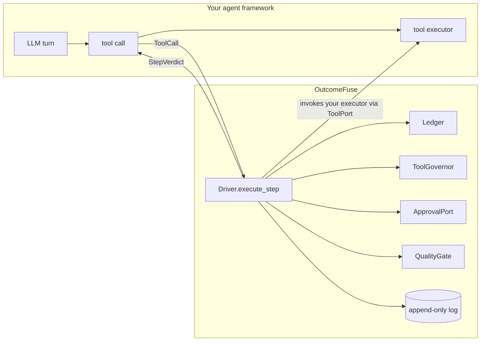

# Integrating OutcomeFuse with another agentic solution

How to put the governor in front of an agent that OutcomeFuse did not write —
what you declare in **YAML**, what you wire in **code**, and what the
architecture will refuse to let you do.

Companion document: [FEATURES.md](FEATURES.md) explains what each mechanism
does and why.

---

## 1. The integration model in one picture

OutcomeFuse is a **governor**, not a framework. It never calls your agent. Your
agent (or its host) **proposes** a step, the governor **decides**, and the host
**applies** the verdict — including termination. That is AD-1, and it is why
integration is a wrapper rather than a rewrite.



Two consequences that shape every integration:

1. **The Driver owns tool execution** through a `ToolPort`. You do not call your
   executor and then ask the governor whether that was allowed — that ordering
   cannot refuse anything. You hand the governor a `ToolPort` that wraps your
   executor, and the governor calls it only after the decision is written.
2. **Enforcement is cooperative.** The governor returns a verdict; a host that
   ignores it produces a plausible and entirely false audit trail. That is why
   the `ProbedToolPort` and the [conformance battery](#12-certify-your-adapter)
   exist, and why an uncertified adapter cannot produce a reportable run.

---

## 2. The four seams

| Seam | Type | You supply | Where |
| --- | --- | --- | --- |
| **Contract** | YAML | quality floor, budget, tools, models, approval clauses | `contracts/*.yaml` → `load_path()` |
| **Tools** | code | a handler table keyed by the contract's tool names | `WorkloadToolPort` |
| **Model** | code | `complete(ModelRequest) -> ModelResponse` | `ModelPort` |
| **Approval** | code | `request(ApprovalRequest) -> ApprovalOutcome` | `ApprovalPort` |

Everything else — ledger, policy ladder, gate, fuse, record spine — is core and
is not yours to reimplement. If you find yourself writing a second policy
ladder, stop: the comparison you produce afterwards will measure your ladder,
not the governor.

---

## 3. Choose an integration mode

| Mode | Use when | Effort | What it proves |
| --- | --- | --- | --- |
| **A — shipped loop** | you want governance and do not care whose loop runs | lowest | the mechanism, end to end |
| **B — your loop, governed** | you already have LangGraph / AutoGen / Semantic Kernel / MCP | medium | governance over *your* agent |
| **C — shadow first** | production traffic, nothing may change yet | low | what *would* have happened |

---

## 4. Mode A — use the shipped loop

`outcomefuse.harness.runner.run_case` **is** the loop, and the plug-in /
plug-out seam is the library's own `Arm` protocol. Swapping `GovernedArm` for
`BaselineArm` is the entire difference between a governed run and an ungoverned
one, and it is an argument.

```python
from pathlib import Path
import sqlite3

from outcomefuse.core.contract import load_path
from outcomefuse.core.policy import Ledger, LoopFuse, Reserve
from outcomefuse.core.record import RecordStore, RunManifest
from outcomefuse.core.verify.registry import REGISTRY_VERSION, registry_digest
from outcomefuse.evidence.store import EvidenceStore
from outcomefuse.harness.cases import load_case_set
from outcomefuse.harness.answer_keys import answer_key_for
from outcomefuse.harness.runner import BaselineArm, GovernedArm, run_case
from outcomefuse.runtime import Driver, ToolGovernor
from outcomefuse.workloads import citable_index_for, tool_port_for

contract = load_path(Path("contracts/supply-chain.contract.yaml"))
case = load_case_set("supply-chain", "calibration").by_id("sc-c-001")
key = answer_key_for(case.case_id, "supply-chain", "calibration")

tools = tool_port_for(contract)
store = RecordStore(Path("runs/mine/sc-c-001-governed.db")).open()
evidence = EvidenceStore(Path("runs/mine/evidence"), data_class="synthetic")

reserve = contract.budget.verification_reserve
driver = Driver(
    run_id="sc-c-001-governed",
    contract=contract,
    store=store,
    ledger=Ledger(
        allocated_tokens=contract.budget.max_tokens,
        allocated_cost=contract.budget.max_estimated_cost,
        reserve=Reserve(
            max_tokens=reserve.max_tokens,
            max_estimated_cost=reserve.max_estimated_cost,
            sizing="declared",
        ),
    ),
    governor=ToolGovernor(contract, approval=my_approval_port),
    tools=tools,
    fuse=LoopFuse(max_iterations=contract.budget.max_iterations),
    evidence=evidence.for_driver("sc-c-001-governed"),
)

driver.open_run(my_manifest)                      # see §10
index = citable_index_for(contract)
if index is not None:
    driver.bind_citable_index(index)              # before any verifier runs

outcome = run_case(
    case,
    contract=contract,
    arm=GovernedArm(driver, start_model=contract.models.start),
    model=my_model_port,
    max_output_tokens=25_000,
    reasoning_effort="medium",
    answer_key=key,
    max_iterations=contract.budget.max_iterations,
)

seal = store.seal(driver.run_id)
store.close()
```

The ungoverned control arm is the same call with
`arm=BaselineArm(tools, model="gpt-5", recorder=BaselineRecorder(...))` — no
`Driver`, because FR52's baseline has no governor to switch off.

A complete, working example of exactly this wiring is
[clients/features/compose.py](clients/features/compose.py).

---

## 5. Mode B — govern your own loop

Your framework keeps its loop, its planner and its memory. OutcomeFuse sits in
front of the **tool executor** and at the **end of the turn**.

### 5a. Wrap your executor as a ToolPort

```python
from typing import Any
from outcomefuse.ports import ToolCall, ToolResult
from outcomefuse.workloads.toolport import WorkloadToolPort

def make_port(contract, framework) -> WorkloadToolPort:
    # keys MUST equal the contract's declared tool names, or construction fails
    handlers = {
        tool.name: (lambda args, name=tool.name: framework.call_tool(name, args))
        for tool in contract.tools
    }
    return WorkloadToolPort(contract=contract, handlers=handlers, side_effects=[])
```

`WorkloadToolPort` refuses at construction if the handler table and the
contract's tool list disagree in either direction. That is deliberate: an
unknown tool name surfacing mid-run is the failure that currently terminates a
governed run fail-closed (see the known defect in
[FEATURES.md §5b](FEATURES.md)).

### 5b. Route every proposed tool call through the Driver

```python
from outcomefuse.ports import ToolCall

def governed_tool_call(driver, name: str, arguments: dict, *, turn: int, unmet: set[str]):
    verdict = driver.execute_step(
        ToolCall(tool=name, arguments=arguments, step_id=f"{case_id}-{turn:02d}"),
        step_class="evidence-gathering",     # or deliverable-mutating / planning / routing
        unmet_mandatory=unmet,
        step_is_enrichment=False,
        estimated_tokens=est_tokens,
        estimated_cost=est_cost,
    )
    return verdict
```

Then map the verdict onto your framework's tool-result channel. **This table is
the contract of the integration.**

| `verdict.action` | What happened | What you must do |
| --- | --- | --- |
| `proceed` | the tool ran; `verdict.result` is its output | return the result to the model |
| `proceed` with `failed=True` | the tool ran and raised; `verdict.detail` is the error | return the error text, **not** a refusal — the agent should try something else |
| `proceed-with-substitution` | cache hit; `verdict.result` is the reused output | return it; do **not** call the tool |
| `deny` | suppressed (`duplicate`, `optional-satisfied`, `approval-denied`) | tell the model plainly it was **not allowed**; never retry silently |
| `terminate` / `return-partial` / `request-human` | `verdict.terminal_reason` is set | stop the loop now; do not send another turn |
| `escalate` | approval timed out and the contract escalates | continue on the escalated model |

`verdict.terminates` is the property to branch on. A host that continues after a
terminal verdict has produced a false audit trail, and the conformance battery
exists to catch exactly that.

### 5c. Meter model turns, or the budget governs the cheap half only

```python
stop = driver.charge_model_turn(
    step_id=f"{case_id}-{turn:02d}",
    tokens=response.prompt_tokens + response.completion_tokens,
    cost=turn_cost,
    model_used=response.provider_version or response.model_id,
)
if stop is not None and stop.terminates:
    return stop
```

Reasoning tokens are **output** tokens and are already inside
`completion_tokens`. Measured: gpt-5 spent 85% of a trivial completion on
reasoning. Omit this call and the largest spend in the run is unmetered.

### 5d. Feed the Loop Fuse

```python
stop = driver.observe_progress(task_state=my_state_snapshot, evidence_count=len(facts))
```

Without it the fuse is wired to nothing and a circling agent is stopped only by
your iteration cap, having paid for every turn on the way.

### 5e. Submit the answer

```python
verdict = driver.submit_deliverable(
    parsed_json_or_None,
    answer_key=key,                      # omit where you have no reference values
    parse_failure="the model emitted prose",   # when parsing failed
)
```

This is the only path by which the moment that matters — the agent claiming it
is finished — reaches a verdict. Skip it and a run can end with an ungated
answer.

### 5f. Framework mapping

| Framework | Hook the ToolPort here | Hook the Driver here |
| --- | --- | --- |
| **LangChain / LangGraph** | a `BaseTool` subclass, or the tool node in the graph | a middleware node before the tool node; end-of-graph node calls `submit_deliverable` |
| **AutoGen** | `register_function` wrapper / `UserProxyAgent` execution hook | a reply hook on the assistant agent |
| **Semantic Kernel** | an `IFunctionInvocationFilter` equivalent | filter pre/post-invocation |
| **MCP client** | wrap `tools/call` before it leaves the client | the client's turn loop |
| **OpenAI Agents SDK / Assistants** | the tool-output submission step | the run-step polling loop |
| **Custom ReAct loop** | your `execute(tool, args)` function | the loop body, as in §5b–§5e |

The pattern is identical in all of them: **intercept the call before it
executes, return the governor's verdict as the tool's result, and honour
termination.**

---

## 6. Mode C — shadow first

`ShadowDriver` records what the governor *would* have done and applies none of
it. `observe_step` returns `None`, there is no ledger to debit, and the
`ApprovalPort` is never called — the pause is *recorded*, not requested.

```python
from outcomefuse.runtime import ShadowDriver, ToolGovernor, build_shadow_report

shadow = ShadowDriver(
    run_id=run_id,
    contract=contract,
    store=store,
    governor=ToolGovernor(contract),      # no approval port: the pause is recorded, not requested
    tools=my_probed_tool_port,            # the host's own tools; shadow still records what ran
)
shadow.open_run(manifest_with_mode_shadow)   # refuses a manifest whose mode is not 'shadow'
for call in proposed_calls:
    shadow.observe_step(call)             # returns None; your host proceeds unchanged
report = build_shadow_report(store.events(run_id))
print(report.label, report.disclosure)    # 'projected', plus FR96's first-divergence wording
```

`request_evidence` refuses any `EvidenceRequest` carrying an estimate: in shadow
the counterfactual is computed from outcomes already observed and never bought,
because buying it would contaminate the one measurement the run exists to
produce.

Rules you cannot opt out of:

- the report's `label` is `projected` and is a `Literal` — it can never read
  `realized`;
- `require_comparable` **refuses** to pair a shadow arm against a real one;
- counterfactual accrual stops at the first terminating decision; host spend
  after that is `avoided_if_enforced_tokens`, never counterfactual spend.

---

## 7. YAML integration — the Outcome Contract

This is the primary integration surface. A contract executes no code: a
criterion **selects a verifier by name** and parameterises it declaratively.

### 7a. Full annotated skeleton

```yaml
contract_id: ofc-my-usecase       # required, 1..128 chars
version: 1                        # required, >= 1
workload: my-usecase              # required; dispatches tools and case sets
task_goal: >
  One paragraph stating what a correct run produces.

deliverable:
  structure:                      # documentation of the JSON shape you expect
    answer_code: string
    citations: array
    confidence: number

criteria:
  mandatory:                      # any failure => verdict `fail`
    - id: answer-matches-key
      description: Why this criterion exists, in a sentence a reviewer can check.
      classification: E           # E | N | A
      verifier:
        type: exact-match-against-answer-key
        args: { path: $.answer_code, key: answer_code }

    - id: citations-resolve
      description: Every cited id exists in the run's citable index.
      classification: E
      verifier:
        type: citation-resolves
        args: { path: '$.citations[*].id', min_citations: 1 }

  optional:                       # evaluated and recorded; never gates
    - id: alternatives-weighed
      classification: E
      verifier: { type: field-present, args: { path: $.alternatives } }

  advisory:                       # model-judged; structurally cannot reach the verdict
    - id: recommendation-is-justified
      classification: A

budget:
  max_tokens: 70000               # > 0
  max_estimated_cost: 0.55        # > 0
  verification_reserve:           # optional; else 15% is derived and recorded as `derived`
    max_tokens: 10000
    max_estimated_cost: 0.08
  max_tool_calls: 35
  max_iterations: 8

tools:
  - name: order_lookup
    deterministic: true           # the Tool Governor caches and dedups on exactly this word
    side_effecting: false
  - name: notify_planner
    deterministic: false
    side_effecting: true          # FR33: never suppressed for optimisation

models:
  eligible: [gpt-5-mini, gpt-5]   # both arms declare the WHOLE list
  start: gpt-5-mini               # must be in `eligible`

escalation:
  on_gate_fail: retry-then-escalate
  max_escalations: 1
  never_breach_verification_reserve: true

human_approval_conditions:
  - tool: notify_planner          # tool XOR criterion, never both
    when: always                  # `always` takes no value
approval_timeout_seconds: 180
on_timeout: request-human         # terminate | escalate | return-partial | request-human
```

### 7b. Verifier argument reference

| `type` | Required args | Optional args | Mode |
| --- | --- | --- | --- |
| `field-present` | `path` | — | constraint |
| `type-is` | `path`, `type` (`string`\|`number`\|`integer`\|`boolean`\|`array`\|`object`) | — | constraint |
| `numeric-range` | `path`, at least one bound | `of` (`value`\|`count`\|`distinct-count`), `min`, `max`, `min_from_key`, `max_from_key` | constraint |
| `set-membership` | `path`, `allowed` (non-empty) | — | constraint |
| `regex-match` | `path`, `pattern` (≤1024 B), `max_input_bytes` (≤65536) | — | constraint |
| `exact-match-against-answer-key` | `path`, `key` | — | **reference** |
| `citation-resolves` | `path` | `min_citations` (default 1) | **reference** |

**The mode is fixed by the type and cannot be asserted by your YAML.** That is
what stops `reference-backed` being claimed for a pass that never touched a
known-correct value.

### 7c. YAML rules the loader enforces

- **No aliases.** `&anchor` / `*ref` are refused (billion-laughs shape).
- **No implicit timestamp resolution.** Date-shaped strings stay strings.
- **≤ 256 KiB, ≤ 24 levels deep.**
- **`extra: forbid` everywhere.** A field nobody declared is a refusal, not a
  silent pass-through.
- A refusal carries the **digest of the refused bytes**, so it can be recorded
  against content rather than against a run that never started.

### 7d. Authoring gotchas that have bitten this repo

- **Single-quote JSONPath containing `[*]`**, and any code anchor ending in `:`
  or containing `{}` — otherwise YAML eats it.
- **Regex inline flags must be at position 0**: `(?is)^...`, never `^(?i)`. Add
  `s` (DOTALL) or a multi-line value fails a check it should pass.
- **Closed vocabularies do not mix.** `on_timeout` names a *policy action*
  (`terminate | escalate | return-partial | request-human`). `fail-closed` is a
  `decision_reason` / `terminal_reason` and is **not** a policy action.
- **Word boundaries in a `regex-match` are hostile to natural prose.**
  `\bclose\b` does not match "closed"; `\bvalidate\b` does not match
  `validate_lines`, because `_` is a word character. A frozen regex of this
  shape failed 9 of 10 *correct* answers in this repository. If your prompt does
  not literally tell the agent the vocabulary you are going to match, do not
  match on a vocabulary.
- **If a criterion demands a minimum (`min_citations: 2`, a count, a length),
  the prompt must ask for it.** A frozen `min: 2` that the prompt never
  requested caused 6 correct answers to be scored as 1 pass — and then, via
  `on_gate_fail: retry-then-escalate`, doubled the token spend of every case.

### 7e. Validate before you run

```pwsh
uv run python -c "from pathlib import Path; from outcomefuse.core.contract import load_path, unsatisfiability_warnings; c = load_path(Path('contracts/my.contract.yaml')); print(c.contract_id, c.digest().sha256); print(*unsatisfiability_warnings(c), sep='\n')"
```

`unsatisfiability_warnings` reports floors that cannot be reached as written —
a verification reserve bigger than the ceiling it is carved from, for example —
*before* the run rather than mid-flight.

---

## 8. The other YAML surfaces

### 8a. Cost table — `cost-tables/*.yaml`

```yaml
version: ct-2
currency: USD
per_tokens: 1000000
source: "vendor pricing page"
source_read_at: "2026-09-11"
rates:
  gpt-5:      { input: 1.25, cached_input: 0.125, output: 10.00 }
  gpt-5-mini: { input: 0.25, cached_input: 0.025, output: 2.00 }
```

**A rate may be `null`.** An unpriced table loads, reports itself as unpriced,
and **refuses to price anything** — it never falls back to zero. A zero rate
yields a clean, plausible and entirely false cost saving that every downstream
check would agree with. Token savings are counted, not priced, so the token
claim stands regardless.

The table's `version` travels in the run manifest, and two runs priced with
different tables are **not comparable**.

### 8b. Preregistration — `preregistration/*.yaml`

Targets and counter-metric thresholds committed before the evaluation split is
opened. `derived_from` must contain the digest of the overhead study the targets
came from — `check_targets_are_derived` enforces "derived, not guessed".

`load_answer_keys(workload, "evaluation")` raises `SealBroken` without a
preregistration hash. The seal is enforced at the **read**, because there is no
way to unsee an answer key and no test that can detect the peek afterwards.

### 8c. Cases and answer keys — `cases/<split>/<workload>/`

`cases.yaml` carries `prompt`, `difficulty`, `expected_outcome`,
`guess_baseline`, and either `prompt_context` or a `reference`. **Only
`{as_of, region, po_id}` survive into a `Case`** — a `reference` is
key-derivation material and the runtime never holds it.

`answer-keys.yaml` is **always derived**, never hand-written. Edit a corpus and
re-run the deriver; a staleness test fails otherwise.

---

## 9. Adding a new use case without touching `src/`

This is the plug-in point, and it was verified by building a whole new use case
outside the distribution.

1. Write `my-usecase.contract.yaml` anywhere and load it with `load_path(path)`.
2. **`tool_port_for(contract)` raises `ToolError` on an unknown workload** — it
   only knows the four built-in ones. Build the port directly instead:

```python
from outcomefuse.workloads.toolport import WorkloadToolPort

side_effects: list[str] = []
port = WorkloadToolPort(
    contract=contract,
    handlers={
        "order_lookup": lambda args: my_db.order(args["po_id"]),
        "issue_refund": lambda args: side_effects.append(f"refund:{args['order_id']}"),
    },
    side_effects=side_effects,
)
```

3. Build a `CitableIndex` if anything in your deliverable is cited:

```python
from outcomefuse.core.verify import CitableEntry, CitableIndex
index = CitableIndex(entries=tuple(
    CitableEntry(id=d.id, target=d.uri, sha256=d.sha256) for d in my_documents
))
driver.bind_citable_index(index)
```

4. Drive it with `run_case` (Mode A) or your own loop (Mode B).

A new use case needs **a handler table, not an edit under `src/`**. Keep your
library imports confined to one composition module so the rest of your client
does not grow a dependency on the governor's internals.

---

## 10. The run manifest — what makes two runs comparable

Every run's log opens with a `RunManifest`, and no comparison may be published
from a run without one.

```python
from outcomefuse.core.record import RunManifest
from outcomefuse.core.verify.registry import REGISTRY_VERSION, registry_digest
import sqlite3

ABSENT = "0" * 64   # honest: a hash over an artefact that does not exist would
                    # make the manifest look more evidential than the run is

manifest = RunManifest(
    run_id="case-001-governed",
    mode="governed",                  # governed | baseline | shadow
    data_class="synthetic",           # no default anywhere; absence is refused
    retention_profile="mvp-synthetic-v1",
    contract_hash=contract.digest().sha256,
    rubric_hash=ABSENT,
    answer_key_hash=ABSENT,
    verifier_registry_version=REGISTRY_VERSION,
    verifier_registry_hash=registry_digest().sha256,
    coverage_report_hash=ABSENT,
    baseline_configuration_hash=ABSENT,
    case_set_id="calibration/my-usecase",
    split="calibration",              # 'evaluation' additionally requires a preregistration hash
    model_ids=("gpt-5-mini", "gpt-5"),          # the WHOLE eligible list, both arms
    provider_versions={"gpt-5-mini": "gpt-5-mini-2025-08-07", "gpt-5": "gpt-5-2025-08-07"},
    cost_table_version="ct-2",
    route="direct",                   # direct | apim
    streaming_disabled=True,          # validator refuses False on any recorded run
    enabled_mechanisms={"tool-governor": "v1", "quality-gate": "v1"},
    adapter_id="my-framework",
    adapter_version="1",
    governor_code_version="0.1.0",
    sqlite_library_version=sqlite3.sqlite_version,
    seed=1,
)
```

**Only `run_id`, `mode` and `enabled_mechanisms` may differ between two arms.**
`require_comparable` refuses on anything else — route, seed, model set, provider
version, cost table, adapter version included. Widening that set is how a
comparison stops being about governance and starts being about configuration.

Escalation is a **mechanism**, recorded in `enabled_mechanisms`, not a different
model list. Declare the full eligible set on both arms.

---

## 11. Plugging in your own ports

### 11a. Model port

```python
from outcomefuse.ports import ModelPort, ModelRequest, ModelResponse, StreamingBarred

class MyModelPort:                       # structurally satisfies ModelPort
    def complete(self, request: ModelRequest) -> ModelResponse:
        if request.stream:
            raise StreamingBarred("streaming is barred on the evidence path")
        ...
        return ModelResponse(
            model_id=request.model_id,
            text=text,
            prompt_tokens=usage.prompt,
            completion_tokens=usage.completion,     # includes reasoning
            reasoning_tokens=usage.reasoning,       # a SUBSET, validated
            tool_calls=tuple(invocations),
            provider_version=served_model_version,  # goes in the manifest
            incomplete=finish_reason == "length",
        )
```

Rules the port must honour, all of them learned the hard way:

- **Refuse streaming.** Gateways estimate token counts when streaming is on, and
  reconciliation would become a comparison of two guesses.
- **Read usage; never estimate it.**
- **`reasoning_tokens <= completion_tokens`** — a validator enforces it.
  Reasoning is billed as output and is part of that total, not additional to it.
- **Carry `incomplete`** rather than returning an empty answer. A capped
  response costs money and returns nothing; that is the arm's failure, and it
  should look like one.
- **Carry malformed tool arguments** on `ToolInvocation.malformed` rather than
  raising. A model emitting broken JSON has failed the step; a raise would turn
  it into a harness crash.
- **Do not send `temperature` / `top_p`** to reasoning models — a field the port
  cannot honour is a setting someone will later believe.

The shipped live example is
[src/outcomefuse/adapters/model/azure_foundry.py](src/outcomefuse/adapters/model/azure_foundry.py);
the deterministic one is `ScriptedModelPort(turns=[...])`, which costs nothing
and reproduces exactly — use it for tests and demos.

### 11b. Approval port

```python
from outcomefuse.ports import ApprovalOutcome, ApprovalRequest

class SlackApprovalPort:
    def request(self, req: ApprovalRequest) -> ApprovalOutcome:
        try:
            channel = self.open_thread(req)          # may raise
        except Exception:
            return ApprovalOutcome(decision="channel-unavailable", clause=req.clause)
        answer = channel.wait(req.timeout_seconds)   # None on timeout
        if answer is None:
            return ApprovalOutcome(decision="no-response", clause=req.clause)
        return ApprovalOutcome(decision=answer, clause=req.clause)
```

- **`channel-unavailable` and `no-response` must never be merged.** The first is
  fail-closed; the second follows the contract's `on_timeout`, which sits lower
  in the ladder. Merging them changes the run's terminal reason.
- **Only a human may say `approved` or `denied`.** `no-response` is the
  *absence* of an answer and `channel-unavailable` is not the human's to
  declare. Accepting either over the wire lets the channel vote.
- **Silence is never consent.** With no channel attached the governor treats the
  condition as unevaluable and the gated call is not made.
- **The request carries the arguments so a person can actually judge it**, and
  those arguments are **not** written to the log — the log keeps the canonical
  key, which is a hash over the whole call.

A working blocking implementation with a browser front end is
[clients/console/approval.py](clients/console/approval.py).

### 11c. Port posture

`PortRegistry.register(name, posture, version)` refuses the wrong posture:
`record`, `approval`, `ledger`, `gate` are **fail-closed**; `model`, `metering`,
`tool-cache` are **fail-open**. Losing an optimisation costs money; losing the
gate costs correctness.

---

## 12. Certify your adapter

An adapter that has not passed the battery **cannot produce a reportable run** —
`RunFacts.adapter_passed_conformance` is checked hard in
`check_admissibility`.

```python
from collections.abc import Sequence
from outcomefuse.conformance import BATTERY, Scenario, run_battery
from outcomefuse.core.record import Event
from outcomefuse.ports import ProbedToolPort

class MyAdapterRunner:                     # satisfies ConformanceRunner
    def run_scenario(self, scenario: Scenario) -> tuple[Sequence[Event], ProbedToolPort]:
        ...                                 # drive your host through the scripted case
        return events, probe

result = run_battery(MyAdapterRunner())
assert result.passed, result.findings
```

The six scenarios are listed in
[FEATURES.md §30](FEATURES.md). Each carries an **out-of-band probe**:
the tools assert for themselves whether they ran, and the battery compares that
against what the log claims. A decision record cannot detect the one failure it
is the evidence for.

Run it **before you spend money** — the campaign does exactly that.

---

## 13. Observing a run from outside

To stream a live run into a UI, subclass the store rather than tapping the
driver:

```python
class TeeStore(RecordStore):
    def append(self, event):
        digest = super().append(event)      # durable FIRST
        try:
            self._sink(event)
        except Exception as exc:
            self.sink_errors.append(f"{type(exc).__name__}: {exc}")
        return digest
```

Emitting before the write would let a watcher see a decision the log does not
contain — the one thing FR5 exists to prevent. Because `open_run` calls `append`
internally, seq 0 (the run manifest) is streamed too. A sink that raises is
swallowed and recorded; a watcher may never break the run it is watching.

To read a finished run:

```python
from outcomefuse.core.record import check_order, fold, open_store

with open_store(path, writer=False) as store:
    events = store.events(run_id)
    state  = fold(events)                 # ledger, quality, decisions, terminal reason
    seal   = store.seal(run_id)           # None while unsealed
    store.verify_run(run_id)              # raises ChainBroken on a selective edit
    findings = check_order(events)        # departures from the canonical order
```

Note `fold` takes `lane=` (`observed` | `counterfactual`) and `check_order`
currently reports one finding per decision on *correct* logs, because nothing
emits `verdict-applied` yet. Treat it as a diagnostic, not a gate.

---

## 14. Operational constraints — read before you deploy

| Constraint | Consequence if ignored |
| --- | --- |
| SQLite library **≥ 3.51.3** | store refuses to open (WAL-reset corruption bug 3.7.0–3.51.2) |
| **Local storage only** — no UNC, no mapped network drive, no nfs/cifs/9p | store refuses to open (WAL's wal-index is shared memory) |
| **One writer per database file**, OS advisory lock | second writer is **refused, not retried** |
| **Unique `run_id` per run** | two runs sharing a file: Windows blocks, POSIX silently deletes the first run's log |
| `data_class` must be stated | `refuse_persistence` returns a refusal reason (it **returns**, it does not raise) |
| `replayed` must name a synthetic origin | production traffic cannot be relabelled synthetic |
| `streaming_disabled=True` | manifest validation fails |
| Evaluation split needs a preregistration hash | `SealBroken` at the answer-key read |
| Python 3.14 + `filterwarnings=error` | unclosed `sqlite3` connections become test failures — close your stores |

---

## 15. Anti-patterns

- **Do not write a second agent loop for the governed arm.** Two loops are two
  agents, and the comparison measures the loops. Use one loop and swap the
  `Arm`.
- **Do not build the baseline as a governed run with mechanisms disabled.** It
  would still carry the driver's ordering, its fail-closed paths and its
  bookkeeping. The baseline holds no `Driver`.
- **Do not let the harness repair the agent's output.** Repair helps whichever
  arm produced the worse output, which is a thumb on the scale in whichever
  direction happens to help.
- **Do not default an unmeasured metric to zero.** `0.0` passes every threshold
  forever while looking like evidence. Report `not measured` and say why.
- **Do not price an unknown model at zero.** The arithmetic will be correct and
  the claim worthless.
- **Do not run the gate early on the control arm.** That hands the baseline the
  mechanism under test.
- **Do not widen the set of manifest fields allowed to differ** to make two runs
  pair.
- **Do not edit a frozen artefact to make a mechanism demonstrate.** Build an
  in-memory variant and say on the card that you did.
- **Do not cache or deduplicate a side-effecting or non-deterministic tool.**
  `optimisable()` is one predicate for exactly this reason; do not re-derive it.

---

## 16. Checklist for a new integration

1. [ ] Contract authored, `load_path` succeeds, `unsatisfiability_warnings` clean.
2. [ ] Every mandatory criterion's demand is something the prompt actually asks for.
3. [ ] Handler table keys equal the contract's tool names exactly.
4. [ ] `deterministic` / `side_effecting` truthfully declared on every tool.
5. [ ] `CitableIndex` bound before any verifier runs, or `None` deliberately.
6. [ ] Model port refuses streaming, reports real usage, reasoning ⊆ completion.
7. [ ] Approval port distinguishes `channel-unavailable` from `no-response`.
8. [ ] Every tool call goes through the Driver; every verdict is honoured, including termination.
9. [ ] `charge_model_turn` and `observe_progress` called every turn.
10. [ ] `submit_deliverable` called at the end, on both arms.
11. [ ] Manifest complete; both arms differ only in `run_id`, `mode`, `enabled_mechanisms`.
12. [ ] Conformance battery passes.
13. [ ] Store sealed, `verify_run` passes, seals kept **outside** the database.
14. [ ] Counter-metrics reported with their basis; unmeasured ones say so.
15. [ ] Anything you worked around instead of fixing is in a disclosure registry.
