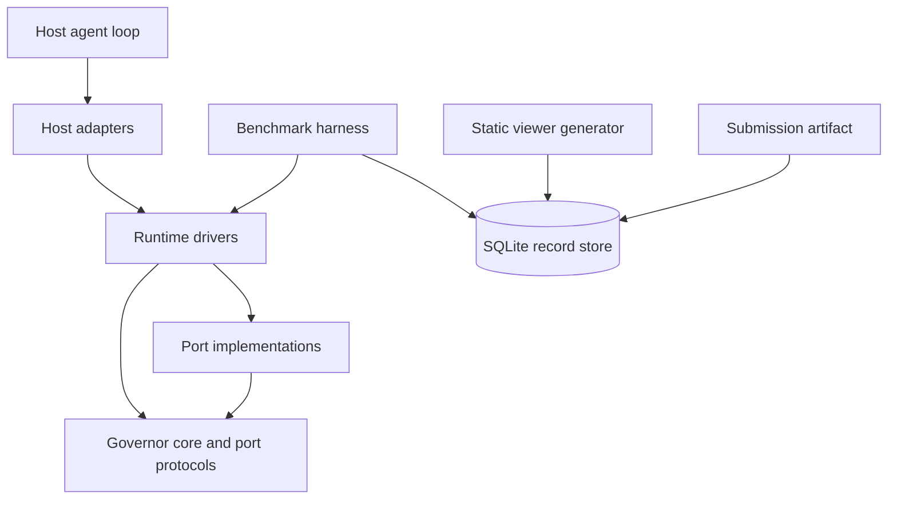
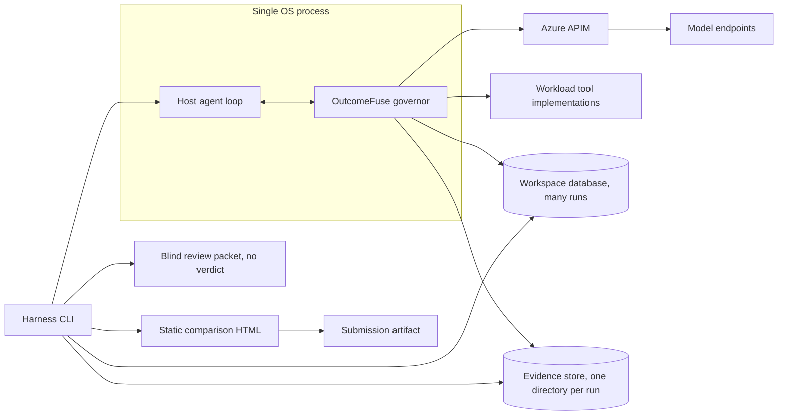
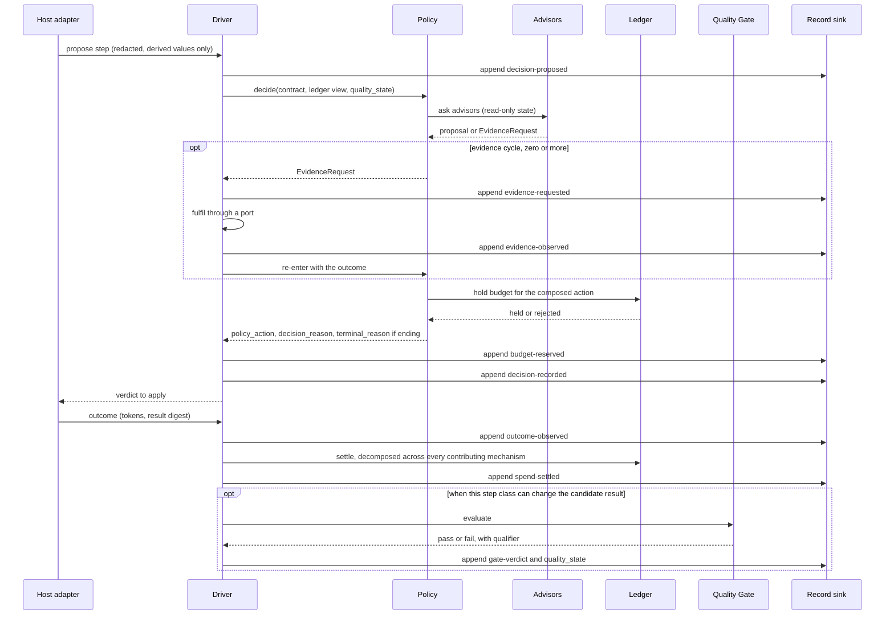
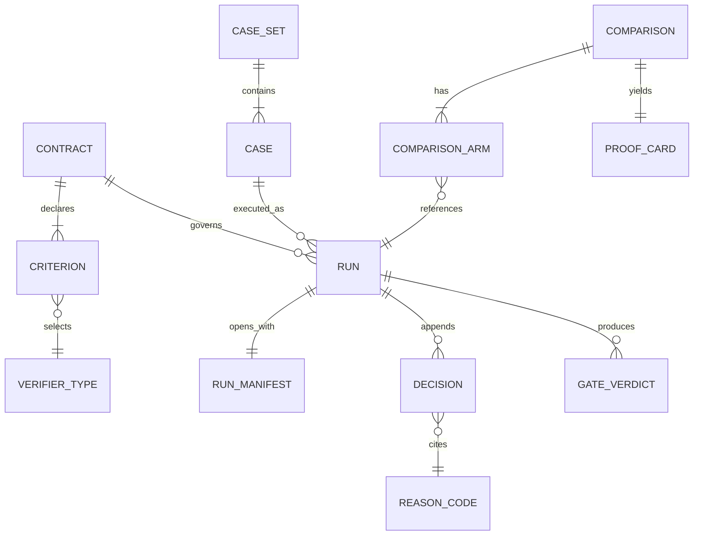
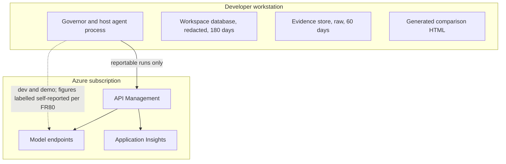

# Architecture Spine — OutcomeFuse

## Design Paradigm

**Ports-and-adapters (hexagonal), with an append-only decision log as the system of record.**

The **governor core** is pure: no I/O, no clock, no randomness, no network. It holds the Outcome Contract, Budget Ledger, Quality Gate, Policy, Loop Fuse, the mechanism advisors, the verifier registry, the reason registry and the canonicaliser. Everything that touches the world is a **port**, defined by the core and implemented outside it. Run state is a **fold over the decision log**, not a second structure kept in sync with it.

| Layer | Namespace | May depend on |
| --- | --- | --- |
| Governor core (incl. port protocols) | `outcomefuse.core`, `outcomefuse.ports` | nothing in this project |
| Runtime drivers (enforcing, shadow) | `outcomefuse.runtime` | core, ports |
| Port implementations (model, record, approval, metering) | `outcomefuse.adapters.*` | core, ports |
| Host adapters | `outcomefuse.adapters.host.*` | core, ports, runtime |
| Benchmark harness | `outcomefuse.harness` | all of the above, record store |
| Static viewer generator | `outcomefuse.viewer` | record store only |



## Invariants & Rules

### AD-1 — Mediated control boundary

- **Binds:** F11, F1, all host integrations, FR50, FR51, FR52
- **Prevents:** One integration honouring a `deny` by raising and another by returning a sentinel, making decision records incomparable across host implementations — and a host silently not honouring `stop-sufficient`, refiling the product's headline event as `halt-exhausted`.
- **Rule:** The governor core is reached only through a narrow port. A host adapter **proposes** a step and **applies** the returned verdict, including termination. Interception and loop-driving are adapter strategies, not architectures. No host framework type may appear above the adapter layer.

### AD-2 — The decision log is the system of record

- **Binds:** F12, F1, F13, F14, F16, FR5, FR6, FR55, FR68
- **Prevents:** Mutable run state and a written log drifting apart, leaving no authority on what actually happened.
- **Rule:** Every decision is appended **before it takes effect**, and **every state change is itself an appended event** — budget reservation and settlement included. Run state (ledger position, `quality_state`, iteration count, decision history) is derived by folding the log, never held as an independent mutable truth. Anything not in the log did not happen and may not be claimed.

  The event order for a single decision is **fixed**, so two compliant implementations produce the same sequence for the same run:

  `decision-proposed` → *evidence cycle* → `budget-reserved` → `decision-recorded` → `verdict-applied` → `outcome-observed` → `spend-settled` → *evidence cycle* → `gate-verdict` (where the unit could change the candidate result).

  An **evidence cycle** is zero or more `evidence-requested` → `evidence-observed` pairs. It may recur wherever an advisor or the Quality Gate needs one — including after `outcome-observed`, which is where the Gate's own executions and their cost land — and every occurrence is logged in place.

  **Replay equivalence** is defined as: identical decision sequence, identical reason codes, identical terminal reason, identical ledger totals. Byte equality of model output is not required and is never claimed.

### AD-3 — One decision lane per run

- **Binds:** F1, F3, all host adapters, FR13, FR16, NFR1
- **Prevents:** Two concurrently proposed steps each passing affordability against the same `remaining` and breaching the ceiling, with no individual rule violated — and a partially ordered log that cannot be replayed deterministically.
- **Rule:** Decisions are taken strictly one at a time per run. The host may execute approved steps in parallel; it may not obtain verdicts in parallel.

  The Ledger holds three distinct quantities and never conflates them: `verification_reserve`, which no step may spend (FR14, FR101); `in_flight`, the sum of outstanding holds; and `spent`. **Every spend is held before it happens — governor overhead included** — and a hold is released by exactly one of `spend-settled`, a denial, or run termination. Each `spend-settled` event carries the id of the decision it settles, so host-side parallel execution cannot make the fold ambiguous. Decision latency is measured against batch width, not per step alone.

### AD-4 — Advisors propose, the driver acts, Policy decides, Ledger writes

- **Binds:** F3, F4, F6, F7, F8, F9, FR4, FR15, FR20, FR37, FR39, FR41, FR43, FR45, FR62, FR98, NFR10
- **Prevents:** One mechanism debiting its own spend while another lets the caller debit — both obeying FR4, yet giving FR15 per-mechanism attribution two meanings and making FR62's ablation compare numbers computed differently.
- **Rule:** Four single writers.
  1. A mechanism is a **pure advisor**. In: read-only state. Out: either a **proposal** (suggested action, estimate, candidate `decision_reason`) or an **`EvidenceRequest`**. `EvidenceRequest` is a **closed, core-owned sum type** with a declared outcome schema per kind — rubric judgement, compression pass, complexity estimate, confidence estimate, planner envelope — and the number of re-invocations one decision may drive is bounded and recorded in the manifest. An advisor never performs I/O and never mutates run state.
  2. The **driver** is the only component that performs port calls. It fulfils an `EvidenceRequest`, appends the outcome, then re-invokes the advisor with the result. Replay is therefore feeding recorded outcomes back into a pure advisor.
  3. The **Policy** is the only component that converts proposals into a decision.
  4. The **Ledger** is the only writer of spend. Every `EvidenceRequest` fulfilment — including every Quality Gate execution under FR98 — is debited as **governor overhead**, attributed to the requesting mechanism, from the driver's recorded outcome and never from a self-report.

  **Attribution is a decomposition, not a winner.** Where several mechanisms contribute to one step's overhead or one step's avoided spend, the Ledger records an explicit decomposition over every contributing mechanism, summing to the total; no tie-break elects a single causer, because FR62's breakdown would then be a function of the tie-break rather than of the mechanisms. Gate executions are attributed to `quality-gate`, a named registry entry that exists for attribution and FR62 ablation even though the Gate is protected.

  **Proposals compose in a fixed, core-owned, versioned order**, recorded with the decision — never per-implementation, because two orders yield different total savings for the same run. Likewise, **which step classes can change the candidate result is declared by the core**, not judged per driver, so FR98's gate cadence is identical across drivers and a run cannot end `halt-exhausted` under one and `stop-sufficient` under another.

  **Disabled means not registered.** No mechanism carries an `if enabled` branch, so an FR62 ablation is a registry change and is byte-identical to having cut the mechanism. **Degraded is not disabled** — see AD-20.

### AD-5 — Redaction at the port

- **Binds:** all ports, all mechanisms, F12, NFR5, NFR12, FR6, FR29, FR37, FR56
- **Prevents:** Sensitive payloads reaching the durable record, where a stack trace or a rendered artifact leaks what the sink was supposed to strip — while still letting the mechanisms that must see content do their job.
- **Rule:** Raw prompts, tool arguments and tool results are a **transient working set**. They exist inside port adapters and inside the narrow, declared core operations that cannot function without them — canonicalise-to-key (FR29), compress-to-capsule (FR37), verify-criterion (FR8). They are never returned upward as free text, never held across decisions, and **never enter the decision log**. What crosses into the record is derived only: scores, estimates, envelopes, canonical keys, content hashes, and **references** to evidence-store objects.

  An evidence capsule preserves attributable facts **verbatim** (FR38) and is therefore raw content: it lives in the evidence store (AD-19), and the log carries its reference and hash, never its body. The driver may hold a raw payload transiently for the single purpose of writing it to the evidence store.

### AD-6 — One canonicaliser

- **Binds:** F2, F5, F6, F13, FR10, FR27, FR29, FR64, FR65
- **Prevents:** The Tool Governor and the harness canonicalising differently — which fails silently as cache misses that should have been hits, or a spurious rubric-drift refusal on a rubric that never changed.
- **Rule:** A single core-owned function serves **every** hashing use: contract identity (FR10), tool-call keys (FR29), the Loop Fuse's progress fingerprint (FR27), result digests, rubric and answer-key freeze (FR65), and baseline-configuration freeze (FR64). Input is validated into a typed model, serialised to **canonical JSON**, then SHA-256'd. The normalisation is **specified and versioned** — sorted keys, no insignificant whitespace, and a single numeric form so that `1.0` and `1` cannot hash differently — because the freeze tool runs before the governor exists and the two must still agree.

  Artifacts that are **source rather than structure** — verifier test files, the baseline definition script — are hashed through a declared **file-digest manifest**: a sorted list of relative path plus SHA-256 of file bytes, itself canonicalised and hashed by the same function. **Every hashed artifact declares its route id**, so two freeze tools cannot silently pick different routes for the same artifact. Within the file-digest route, paths are **POSIX-separated, NFC-normalised and byte-sorted**, and text artifacts are digested with **LF line endings** — a Windows freeze and a Linux freeze that disagree would produce exactly the spurious FR65 drift refusal this decision exists to prevent. Those are the only two admissible routes, and no component may hash by any other means.

### AD-7 — A contract executes no code

- **Binds:** F2, F4, F13, FR7, FR8, FR9, FR10, FR21, FR65, FR108
- **Prevents:** Remote code execution driven by a data file, in a product whose position is that platform teams hand contracts to agent owners — and a contract hash that attests to a verifier whose behaviour can change underneath it.
- **Rule:** FR8's "executable deterministic verification method" is a selection from a **closed, project-owned verifier registry**, parameterised declaratively (field-present, type-is, numeric-range, set-membership, regex-match, exact-match-against-answer-key, citation-resolves). No import path, expression or callable reference crosses the contract boundary. Contract validation rejects a mandatory criterion whose verifier type is not in the registry. The `reference-backed` / `constraint-backed` qualifier is determined by which registry entry was used, not separately asserted.

  Two further closures make that real rather than nominal:

  - **Parsing.** Contracts load through a **safe loader only** — no tag resolution, no object construction — under bounded input size and nesting depth. Parsing precedes the run manifest, so a rejection is recorded against the contract's content hash rather than against a run.
  - **No verifier performs I/O, and none reads run state.** A verifier is a **pure function of its declared arguments**. `citation-resolves` takes the run's **derived citable index** as an *argument supplied by the caller*; it never fetches it, and never touches the evidence store (AD-19). No verifier makes a network or filesystem call, and the registry is closed to any type that would. Regex verifiers run against bounded input under a step budget. A verifier that could reach the network would be an exfiltration channel straight through AD-5 and would break core purity and FR68 replay at once.

  The citable index is itself pinned, because an unshaped argument moves the divergence rather than closing it: it is a **core-owned typed model** — identifiers, citation targets, content hashes — **built by the driver**, canonicalised and hashed under AD-6, with its hash **appended before any verifier is invoked**. Two implementations deriving it differently would otherwise produce different verdicts, and therefore different terminal reasons, for the same run.

  Purity is what keeps the freeze buildable: every verifier is testable against fixtures alone, so its determinism and replay tests need neither the record spine nor a live run.

  The verification **mode is a property of the verifier type**, fixed here, not asserted per contract — which is what stops `reference-backed` being claimed for a pass that never touched a known-correct value:

  | Verifier type | Mode |
  | --- | --- |
  | `field-present`, `type-is`, `numeric-range`, `set-membership`, `regex-match` | `constraint-backed` |
  | `exact-match-against-answer-key`, `citation-resolves` | `reference-backed` |

  **Registry breadth is settled before the freeze, not guessed at.** One Outcome Contract is authored per committed workload, and every intended criterion is classified `E` (expressible today), `N` (a new deterministic type is demonstrably needed) or `A` (advisory). The review shall explicitly cover the criteria that are easiest to miss because they are semantic — root-cause correctness, query-result correctness, code-location correctness, evidence completeness, and whether a conclusion is *supported* rather than merely present.

  A demonstrated gap admits **at most three** further types. Each must be reusable beyond one case, deterministic over identical canonical inputs, project-implemented, free of network, filesystem, model and clock I/O, bounded and declarative in its parameters, fixed in mode by the registry, and covered by positive, negative, boundary, malformed-input and replay tests. `semantic-match`, `llm-judge`, `root-cause-quality` and `citation-supports-claim` are barred unless reducible to deterministic comparison against frozen structured reference data.

  A per-workload **verification-mode coverage report** — counts and percentages of mandatory criteria that are reference-backed versus constraint-backed — is published with the freeze, because FR21's run-level qualifier hides how much of a floor is substantive rather than structural. A workload is **predominantly constraint-backed** where `constraint_backed_mandatory_count > reference_backed_mandatory_count`, and must be reported as such; one with zero reference-backed mandatory criteria may still be evaluated but may not be used to imply that OutcomeFuse independently established semantic correctness.

  **The registry, its tests and the coverage report are content-hashed in the same operation as the rubric and answer keys** (FR65). A frozen rubric whose criteria take their executable meaning from an unfrozen registry is not frozen.

### AD-8 — The record schema and reason registry are owned here

- **Binds:** F12, F13, F14, F16, FR53, FR60, FR104
- **Prevents:** FR104's promise — that a published code still means what it meant — being delegated to an external specification that can revoke it.
- **Rule:** The decision-record schema and the `decision_reason` registry are project-owned artifacts, each carrying a version stamped onto every decision row. OpenTelemetry GenAI attribute *names* may be borrowed as a naming convention; the schema **shall not depend** on that specification, which is still Development-status with no published releases. Published reason codes are never redefined, repurposed or removed. Every decision row also carries the governor's own wall-clock decision cost, so NFR1 is measured from the record rather than instrumented separately.

### AD-9 — Every run opens with a manifest

- **Binds:** F13, F15, F16, FR62, FR64, FR65, FR66, FR68, FR102
- **Prevents:** The harness, an adapter and the viewer each deciding independently what constitutes a run's configuration — surfacing later as an unexplainable difference between two runs believed identical.
- **Rule:** The first entry of every run's log is a **run manifest** carrying: run id; mode (`governed` · `baseline` · `shadow`); **`data_class`** and the retention profile it selects — supplied by the **frozen case-set attestation**, with **no default**, so a run whose class is absent is refused rather than assumed benign; contract hash; rubric and answer-key hash; **verifier-registry version and hash, and the coverage-report hash** (AD-7); frozen baseline-configuration hash; case-set identity and `calibration` | `evaluation`; model ids with provider versions; pinned cost-table version; route (`apim` | `direct`); streaming disabled; enabled-mechanism registry with versions; adapter id and version; governor code version; **`sqlite3` library version** (AD-16); and the seed and sampling parameters. **No comparison may be published from a run without a manifest.**

  The calibration/evaluation split is not a label alone. A **preregistration record** — savings and quality targets, counter-metric thresholds, minimum case counts, blind-review sample size — is written as its own hashed, timestamped artifact, and **every evaluation-set run's manifest carries that record's hash**, so the FR102 ordering guarantee is anchored to content rather than to a timestamp asserted by the interested party. The harness refuses any comparison in which evaluation execution precedes preregistration.

### AD-10 — Reportability is one predicate, and publication carries its guards

- **Binds:** F13, F14, F15, F16, §3.3, §8, FR49, FR59, FR61, FR62, FR63, FR66, FR70, FR78, FR79, FR80, FR82, FR102
- **Prevents:** Each surface inventing its own notion of which figures may be quoted; a demo convenience leaking into a judged claim; and a bare savings number shipping without the measurement that exists to refute it.
- **Rule:** Three gates, evaluated by the harness alone. No other component re-derives any of them.

  **Admissibility — hard; a failing run is refused, not labelled.** Non-streaming; adapter has passed conformance (AD-15); manifest present and complete (AD-9); and, for a headline claim, drawn from the sealed evaluation set with the preregistration hash present in the manifest. The two arms of a comparison shall be **manifest-identical except for the run id and for the fields the comparison exists to vary** — mode, and the enabled-mechanism registry. The harness compares manifests field by field and refuses on any other difference, route, model version, cost-table version, seed and adapter version included.

  **The baseline arm is built by nobody.** FR52's OFF is an **adapter state, not a driver**: with the governor out of the call path entirely, the baseline arm shares no governor code with the governed arm, so its latency is not governor-inflated and §8.1's fairness commitment is structural.

  **Independence — graded; degrades the label, never refuses.** Gateway-metered figures are labelled measured. Where metering is unavailable the run falls back to governor-side counting and every figure it yields is labelled **self-reported** (FR80) — the stated independence is downgraded, the run is not discarded. Shadow figures are labelled projected (FR49), degraded runs carry their degradation (AD-20), constraint-backed passes carry their qualifier (FR21).

  **Publication accompaniment — hard.** The harness refuses to emit: a headline figure without its per-mechanism breakdown (FR62); a tool-call reduction without tool-suppression accuracy (FR70); any workload below its declared minimum case count (FR59); a gross figure as the headline (FR61); successes without the failures and escalations alongside them (FR63); any counter-metric lacking its preregistered threshold (§3.3, FR66); or any workload result without its **verification-mode coverage report**, carrying the **predominantly constraint-backed** label where AD-7's condition holds.

  Streaming is barred on the evidence path because APIM **estimates** both prompt and completion tokens when `stream: true`, which would make FR79 a reconciliation between two guesses and leave F15 buying nothing.

### AD-11 — Shadow mode is a driver, not a flag

- **Binds:** F10, F1, §10, FR46, FR48, FR49, FR91, FR96, FR106
- **Prevents:** A shadow branch inside the Policy, inside every mechanism, and — because FR91 exempts shadow from fail-closed — inside the fail-closed paths, placing a conditional in the most safety-critical code on the branch least exercised by tests.
- **Rule:** The Policy is unchanged and always decides as if enforcing. A **shadow driver** records each decision and declines to apply it.

  FR91 is broader than "applies no halts": in shadow the driver **alters nothing the host would otherwise do**. It fulfils no `EvidenceRequest` that would spend against the observed path — counterfactual estimates are computed from outcomes already observed — and it does not call the `ApprovalPort`, recording instead the pause it would have imposed. Any governor spend a shadow run does incur is recorded separately and never debited to the observed run's ledger, because FR48 makes that path the only measured one.

  FR96's first divergence is the first decision the driver declined to apply — observed by the driver, not computed by a mechanism. The estimated counterfactual ledger is structurally barred from AD-10 admissibility.

### AD-12 — Human approval is a port with a scripted decider

- **Binds:** F6, §9, §10.2, FR2, FR34, FR89, FR95, FR100
- **Prevents:** FR89's fail-closed-on-unavailable being asserted rather than exercised, FR100's approval-timeout cases requiring a human to sit in front of a harness whose entire value is reproducibility, and — the sharper one — a plain timeout being misrouted as an unavailability.
- **Rule:** Approval is obtained through an `ApprovalPort`. The MVP implementation is a **scripted decider driven by the case definition** (approve · deny · never respond).

  Two failure states are **distinct and shall not be merged**, because FR2 ranks them differently:

  | State | Meaning | Outcome |
  | --- | --- | --- |
  | **`channel-unavailable`** | The adapter cannot accept or create the approval request, or loses the decision channel of a request it had accepted | FR89 — fail-closed; the gated call is not made |
  | **`no-response`** | The request was accepted and the channel stayed available, but no decision arrived within `approval_timeout` | FR95 — the contract's `on_timeout`, defaulting to the `approval-timeout` triple |

  Collapsing the second into the first would route an ordinary timeout to `fail-closed`, which sits **above** the approval gate in FR2's ladder — changing both the run's terminal reason and what the caller receives.

### AD-13 — The model seam is owned

- **Binds:** F8, F3, F15, FR15, FR40, FR41, FR60, FR78, FR79
- **Prevents:** FR79 becoming a reconciliation between two numbers the project did not compute, with no way to say which is wrong when they disagree.
- **Rule:** All model access goes through a project-owned `ModelPort`. LiteLLM sits **behind** it; no LiteLLM type, exception or cost table appears above the port. The cost table consumed from it is **pinned and recorded in the manifest**, because a pricing change between calibration and evaluation would silently move the cost figure.

### AD-14 — The tool cache is run-scoped

- **Binds:** F6, FR30, FR31, FR68, NFR6
- **Prevents:** A persistent cache being adopted as a free win — making FR68 re-executability depend on cache warmth, making two supposedly identical runs differ, and putting NFR6 tenant partitioning on the hot path.
- **Rule:** Tool-result reuse is scoped to a single run and a single process. No cross-run, cross-process or persistent cache exists. NFR6 isolation is discharged structurally: a run belongs to one tenant and one use case, so cross-user reuse is impossible by construction.

### AD-15 — Adapters pass conformance or produce nothing

- **Binds:** F11, F13, AD-1, AD-10, FR51, FR100
- **Prevents:** A sloppy adapter silently failing to honour a deny or a stop, so the system reports a plausible run that never obeyed its own policy.
- **Rule:** A fixed battery of scripted scenarios — deny honoured, substitution applied, approval pause observed, sufficiency stop terminates, fail-closed halts, shadow decisions not applied — is asserted **against the resulting decision log**, never against adapter internals. An adapter that has not passed the suite cannot produce a reportable run.

  The battery additionally carries an **out-of-band side-effect probe**: scripted tools assert for themselves whether they were invoked. Enforcement is cooperative by AD-1's construction, so an adapter that executes a gated or denied call while recording a clean pause must be caught by the tool — not by the log it just falsified.

### AD-16 — One workspace database, append-only, sealed per run

- **Binds:** F12, F13, F14, F16, FR54, FR68, NFR12
- **Prevents:** Four consumers disagreeing about where the record lives or whether it can be edited after the fact.
- **Rule:** The record store is SQLite: **one canonical database per benchmark workspace, holding many runs**, alongside **one evidence directory per run** (AD-19). The record writer exposes append only; no `UPDATE` or `DELETE` is issued against the decision table.

  Concurrency is **imposed, not assumed**, because AD-3's decision lane is per *run* while the harness may execute runs concurrently. WAL gives one writer at a time and reports contention as `SQLITE_BUSY`; it does not queue for you. So: **`sqlite3` library version ≥ 3.51.3**, asserted at store open and recorded in the manifest — the WAL-reset corruption bug present from 3.7.0 through 3.51.2 triggers on exactly this workload, concurrent writers or checkpointers on one file. **One writer per database file, enforced by an OS advisory lock taken at store open; a second writer is refused, not retried** — an in-process lock is void the moment a harness forks a subprocess per case, which is a legal implementation. `BEGIN IMMEDIATE` rather than the deferred default, so a transaction cannot upgrade mid-flight and lose its busy retry; an explicit **busy timeout**; and `synchronous=FULL`, since WAL with `NORMAL` syncs only at checkpoint and forfeits durability on power loss. The database lives on **local storage only** — WAL's shared-memory wal-index does not work over a network filesystem.

  Append-only is writer discipline, so integrity is carried structurally instead: **each row holds the hash of its predecessor within its own run**, so every run is a hash chain inside the shared file. The terminal row's hash is the **run seal**. What the chain proves is bounded and should not be oversold: `VACUUM` and checkpointing rewrite pages but never row values, so neither breaks it — but a chain whose seal lives only in the same file proves nothing against someone rewriting the file and recomputing. **Tamper-evidence is load-bearing only because every proof card carries the seals of the runs it compares, outside the database.** It establishes neither authorship nor time.

  **Retention follows sensitivity, not file layout** (AD-19): the redacted log is the long-lived tier, archived or deleted **per workspace**; raw evidence is the short-lived tier, deleted **per run**.

### AD-17 — The side-by-side view is generated, not served

- **Binds:** F14, F13, F16, FR72–FR77, FR97
- **Prevents:** FR77's "no path to influence execution" degrading into a discipline, and a protected submission depending on a cut-first component.
  **Rule:** F14 is a **static HTML artifact generated by the harness** from the decision log — one self-contained file per comparison, embedding the replay timeline, ledger state at each decision, the rendered proof card and enough record to satisfy FR76 offline. It computes no proof figures (FR97 owns those). The generator reads the **decision log and proof card only, never the evidence store**, so no raw customer content can reach an artifact handed to a third party. Autoescaping is enabled **explicitly** at template-environment construction — it is opt-in, not the default — because record content is untrusted input. There is no running viewer process.

### AD-18 — The quality floor is protected by the Policy, not the estimator

- **Binds:** F1, F3, §1.5, §9, FR11, FR17, FR93, FR99
- **Prevents:** The floor-protection carve-out living inside a pluggable estimator, so swapping the estimator silently removes the one rule the PRD calls non-negotiable.
- **Rule:** The marginal-value estimator is pluggable and may only ever **propose** `low-value`. The **Policy** rejects any `low-value` proposal whose step would establish, verify or correct an **unmet mandatory** criterion or evidence field; the proposal is discarded and the attempt is recorded, so FR99 reports it as a violation rather than a saving. Where the floor is unmet and no affordable step advances it, the Policy terminates per FR93 rather than continuing to propose steps that will be denied.

### AD-19 — The evidence store is separate, and has a declared lifetime

- **Binds:** F12, F13, §8.2, FR69, FR70, FR71, NFR5, NFR6, NFR9, NFR12
- **Prevents:** The blind-review packet being rendered from the same store that carries the gate verdict and the decision record — which would silently invalidate false-sufficiency rate, the counter-metric the headline claim rests on — FR70 / FR71 having no artifact left to measure against, and the one store holding raw content having no declared lifetime.
- **Rule:** Deliverables, evidence capsules, and the raw tool outputs FR70 re-execution and FR71 fidelity measurement require, are persisted in an **evidence store separate from the decision log**, keyed by run and step. The **driver is its sole writer; the harness is its sole reader.** Verifiers never read it — they read the run's derived citable index (AD-7). The **FR69 blind-review packet** is rendered from the evidence store plus the contract, and the renderer is **structurally denied** access to the gate verdict, the decision record and the run manifest. Nothing in the evidence store may be cited as a decision input.

  **Layout and lifetime.** Evidence lives under `evidence/<run_id>/` and is deleted as a **whole directory** — deliverables, capsules, raw tool outputs, suppression re-execution artifacts, compression-fidelity artifacts, generated blind-review packets and temporaries.

  **A campaign is a workspace**; the two words name one thing, and the workspace database (AD-16) is its record. **Campaign seal is a harness command, executed once**, refused while any run is unsealed; after seal the store refuses to open a writer, so no run can join a sealed workspace. `max(run_closed_at) ≤ campaign_sealed_at` is asserted at seal.

  Run closure is an **appended event, never an update** — AD-16 forbids `UPDATE`, so `run_closed_at` cannot be written onto an existing row. The driver appends a **`run-closed`** event, which *is* the run's terminal row and therefore its seal. The harness's sweep appends **`run-abandoned`** to any run still unsealed at campaign seal, which both seals it and gives it an expiry — without which abandoned evidence would never acquire one and would live forever. No column is ever mutated.

  Under retention profile **`mvp-synthetic-v1`**, raw evidence expires at `run_closed_at + 60 days`; expiry is never derived from filesystem modification, access or copy time. Redacted decision records and proof artifacts are retained **180 days from campaign seal**. Because seal is refused while any run is unsealed, the redacted tier always outlives the raw tier it describes. **There is no per-run extension:** evidence that expires before an FR69 / FR70 / FR71 assessment completes is regenerated by re-running the frozen case, so the retention rule cannot become negotiable at exactly the moment someone wants it to be.

  Deletion writes a **content-free receipt** — `run_id`, `evidence_manifest_hash`, `retention_profile`, `scheduled_expiry_at`, `deleted_at`, result — to the campaign retention manifest, which is a **separate append-only artifact**. A receipt is **never written into any run's hash chain**, so no act of retention can alter a seal (AD-16). This is logical deletion appropriate to synthetic data; it is not cryptographic erasure and shall not be described as such.

  **Access is a matrix, not a convention:**

  | Actor | Access |
  | --- | --- |
  | Runtime driver | Write — its own run only |
  | Benchmark harness | Read; generates the FR69–FR71 artifacts |
  | Retention command | Delete, plus manifest status — nothing else |
  | Blind-review renderer | Read evidence + contract; **no** verdict, decision record or manifest |
  | Verifiers, host adapters, static viewer, submission generator, model and approval adapters | **None** |

  The evidence root stays gitignored and out of generated HTML, the submission archive, test snapshots and application logs.

### AD-20 — Failure posture is placed, not chosen per site

- **Binds:** §10, F7, F8, F9, F13, FR85, FR86, FR87, FR88, FR89, FR90, FR91, FR100, NFR4
- **Prevents:** Each mechanism author choosing its own behaviour on failure, and a degraded run being indistinguishable from a clean one in the record.
- **Rule:** **Fail-open is a property of the advisor registry:** an advisor that raises is deregistered for the remainder of the run, execution continues without it (FR85), and a `degraded` event naming the mechanism is appended to the log. **Fail-closed is a property of the driver:** Gate-verdict unavailability, ledger-state loss and approval-**channel** unavailability terminate through the FR2 ladder (FR87–FR90) — an approval **timeout** does not, and is governed by AD-12. The shadow driver applies neither (FR91).

  **Degraded is not disabled.** The manifest records the enabled set at start (AD-9); the log records deregistrations during the run; any run carrying a deregistration is marked degraded and every figure it yields carries that label (FR86, AD-10).

  The advisor registry is **run-scoped** — constructed at run start from the manifest's enabled set, discarded at run end. A deregistration never survives the run that caused it, so a transient failure in one repeat cannot silently degrade every repeat that follows it in the same process (FR58).

### AD-21 — Non-synthetic data is refused, never inherited

- **Binds:** F10, F12, F13, AD-9, AD-16, AD-19, FR106, FR109, NFR6, NFR9, NFR12
- **Prevents:** Production, confidential or customer traffic silently inheriting a retention profile designed for data the builder authored — the most likely way this system acquires a compliance problem, precisely because it requires nobody to decide anything.
- **Rule:** `mvp-synthetic-v1` is admissible for **`synthetic` only**. Every run declares a `data_class` in its manifest (AD-9), and **`replayed` inherits the class of the run it replays** — replaying captured production traffic does not launder it into synthetic. Where the class is anything other than `synthetic` and no approved production-data profile exists, the runtime **refuses to persist — evidence and decision log alike** — rather than falling back to the MVP rule. Refusing only the evidence would leave the record under AD-16 with no permitted retention profile, which is NFR12 unmet by a narrower route; and keying the refusal on `non-synthetic` alone would let `replayed` walk straight past it.

  That profile must settle tenant and use-case partitioning, approved storage location, encryption in transit and at rest, workload and operator identities, role-based read / write / delete, legal and compliance classification, retention by data class, deletion SLA and verification, backup and replica deletion, incident handling and disclosure, audit access, export restrictions, and whether specific raw fields may be persisted at all. FR106 stands until it exists.
## Consistency Conventions

| Concern | Convention |
| --- | --- |
| Naming — entities | `Contract`, `Ledger`, `Gate`, `Policy`, `LoopFuse`, `Decision`, `RunManifest`, `ProofCard`. A mechanism is `<Thing>Advisor`; a port is `<Thing>Port`; an implementation is `<Impl><Thing>Adapter`. |
| Naming — files | `snake_case.py`; one port protocol per module; host adapters under `adapters/host/<framework>/`. |
| Naming — reason codes | Lowercase kebab, drawn from the FR104 registry, prefixed by family in reporting only — never in the stored code. |
| Ids | Run id, contract id and case id are ULIDs; hashes are lowercase hex SHA-256 with no prefix. |
| Dates & times | UTC, RFC 3339 with explicit `Z`. The clock is a port; core code never calls `datetime.now`. |
| Numbers | Tokens are integers. Estimated cost is decimal, never binary float, and always carries its pinned cost-table version. |
| Errors | Core raises typed domain errors only; ports translate foreign exceptions at the boundary. A port error is a **decision input**, never an escape. |
| Config | Contracts are YAML; harness and runtime configuration is TOML; secrets come from environment only. **No credential ever appears in a contract** (NFR7). |
| Logging | Application logs are for humans and carry no decision authority. The decision log is the record; the two are never conflated. |
| Determinism | Core is pure and seeded. Any nondeterminism enters through a port and is recorded in the manifest. |
| Testing | Core is tested with no network and no model. An adapter is admitted by the AD-15 conformance battery, never by its own unit tests. Replay equivalence (AD-2) is the regression oracle for FR68 and NFR3. |
| Retention | Two tiers by sensitivity: raw evidence per run under `mvp-synthetic-v1`, redacted log per workspace. Expiry derives from `run_closed_at`, never from a filesystem timestamp. |

## Stack

Verified current on 2026-09-07; the code owns these once it exists.

| Name | Version |
| --- | --- |
| Python | 3.14 (3.14.7 current; ceiling pinned below 3.15) |
| uv | 0.12.10 |
| ruff | 0.16.6 |
| pytest | 9.1.1 |
| pydantic | 2.13.5 |
| PyYAML | 6.0.3 |
| typer | 0.27.2 |
| Jinja2 | 3.1.6 |
| litellm (behind `ModelPort`) | 1.100.0 |
| SQLite | stdlib `sqlite3`, library version **≥ 3.51.3** — asserted at open; earlier versions carry a WAL-reset corruption bug on concurrent writers |
| langgraph (host adapter) | 1.2.11 — declares classifiers only to 3.13; validate on 3.14 before committing the adapter |
| agent-framework (host adapter) | 1.17.0 |
| openai-agents (host adapter) | 0.22.0 — pre-1.0; pin exactly, never a range |
| typer | 0.27.2 — pre-1.0 and Beta-classified; pin exactly |
| Azure API Management | `llm-token-limit` + `llm-emit-token-metric`; **tier must support `llm-token-limit`** — not Consumption |

## Structural Seed

### System view



### One decision



### Core entities



### Deployment and environments



Two environments only: the developer workstation, and a single Azure subscription hosting the APIM instance. No staging tier exists and none is warranted at MVP. A working APIM instance is a **critical-path dependency** before any evaluation-set run.

Three gateway constraints are load-bearing and are recorded rather than discovered later. The APIM **tier must support `llm-token-limit`** — it is unavailable on Consumption, and its absence would silently downgrade every run to FR80 self-reported. `llm-token-limit` returns a **combined** prompt-plus-completion count, so FR79 reconciles on the total; the directional split stays governor-side and is labelled as such. `llm-emit-token-metric` silently discards data past its dimension and time-series limits, so metric-backed figures are cross-checked against the response-header count rather than trusted alone.

### Source tree

```text
outcomefuse/
  pyproject.toml            # uv project, src layout, host adapters as optional extras
  src/outcomefuse/
    core/                   # PURE — no I/O, no clock, no network
      contract/             # schema, validation, canonicalise, verifier registry
      ledger/               # allocate, reserve, settle, attribute
      gate/                 # criterion evaluation, verdict, quality_state
      policy/               # the FR2 precedence ladder, proposal resolution
      fuse/                 # progress fingerprint, no-progress halt
      advisors/             # tool, context, model, planner, marginal-value
      reasons/              # versioned decision_reason registry
    ports/                  # Protocol definitions only
    runtime/                # drivers: enforcing, shadow; composition root (OFF is an adapter state, not a driver)
    adapters/
      model/                # litellm-backed ModelPort
      record/               # sqlite RecordSink
      approval/             # scripted decider
      metering/             # APIM token reconciliation
      host/
        reference/          # hand-rolled ReAct loop — conformance reference
        langgraph/
        agentframework/
        openai_agents/
    harness/                # CLI, runner, ablation, proof card, conformance suite
    viewer/                 # Jinja2 static HTML generator
  cases/
    calibration/
    evaluation/             # sealed until preregistration completes
  contracts/                # one per committed workload, authored before the freeze
  preregistration/          # hashed, timestamped target records (FR66, FR102)
  workspace/                # gitignored output
    outcomefuse.db          # canonical record store, many runs, WAL, writers serialised
    evidence/<run_id>/      # raw tier - deleted whole at run_closed_at + 60 days
    retention-manifest.md   # append-only, content-free deletion receipts
    reports/                # generated comparison HTML
  tests/
```

## Capability → Architecture Map

| Feature | Lives in | Governed by |
| --- | --- | --- |
| F1 Runtime Decision Policy | `core/policy` | AD-2, AD-3, AD-4, AD-8, AD-18 |
| F2 Outcome Contract | `core/contract` | AD-6, AD-7 |
| F3 Budget Ledger | `core/ledger` | AD-3, AD-4, AD-13, AD-18 |
| F4 Quality Gate | `core/gate` | AD-7, AD-4, AD-20 |
| F5 Loop Fuse | `core/fuse` | AD-2, AD-4, AD-6 |
| F6 Tool Governor | `core/advisors`, `ports` | AD-4, AD-5, AD-6, AD-12, AD-14 |
| F7 Context Governor | `core/advisors` | AD-4, AD-5, AD-19, AD-20 |
| F8 Model Governor | `core/advisors`, `adapters/model` | AD-4, AD-13, AD-20 |
| F9 Preflight Planner | `core/advisors` | AD-4, AD-20 |
| F10 Shadow Mode | `runtime` | AD-11, AD-10, AD-20, AD-21 |
| F11 Integration Surface | `adapters/host/*` | AD-1, AD-15 |
| F12 Decision Record | `adapters/record`, `core/reasons` | AD-2, AD-5, AD-8, AD-16, AD-19 |
| F13 Benchmark Harness | `harness` | AD-9, AD-10, AD-15, AD-16, AD-19, AD-21 |
| F14 Side-by-Side View | `viewer` | AD-17, AD-16 |
| F15 Gateway Metering | `adapters/metering` | AD-10, AD-13 |
| F16 Submission Artifact | consumes `harness` + record store | AD-9, AD-10, AD-17 |
| §10 Failure posture | `runtime`, `core/policy` | AD-20, AD-4, AD-11, AD-12 |

## Deferred

- **Managed-service deployment beyond the APIM metering slice.** The MVP is in-process by design (§4.2). Revisit when a hosted governor is the deliverable rather than the story.
- **Persistent / cross-run tool cache.** Legitimate post-MVP lever. Requires a tenant-partitioned key and an answer for how FR64 and FR68 stay honest when cache warmth varies between runs.
- **Multi-process or distributed governor.** AD-3's single decision lane is a per-run, in-process guarantee. A distributed ledger with the same properties is a different design; nothing here forecloses it.
- **Contract authoring surface, template library, eval-suite import, versioning UI.** Out of MVP scope (§4.2). AD-7's closed registry is the constraint any future authoring surface must respect.
- **Learned marginal-value estimation.** FR17's estimator is pluggable behind AD-4; its floor-protection carve-out is not, and lives in the Policy under AD-18.
- **Live production traffic shadowing.** FR106 confines MVP shadow evidence to synthetic and replayed workloads.
- **OpenTelemetry export.** Deferred until the GenAI semantic conventions reach a tagged stable release; AD-8 keeps the internal schema independent so adopting them later is an additive mapping.
- **Production ground truth without hand-authored answer keys** (PRD Q9). The gate's authority rests on synthetic keys; AD-7 makes the limit explicit per contract rather than solving it.
- **CI cost-regression gate, multi-agent budget transfer, policy DSL.** Product vision, not MVP.

## Open Questions

None outstanding. All three carried questions are closed; the decisions live in the ADs above and their reasoning in the memlog.

- **Q-A — Closed 2026-09-07.** The third host adapter and the conformance battery diverged from the PRD. PRD amended: adapter at cut-order position 2 (§4.3), battery as **FR107** in F11.
- **Q-B — Closed 2026-09-09.** Verifier-registry breadth is settled by the pre-freeze acceptance gate now in **AD-7**: the seven types stay the default, breadth is proven by four real contracts rather than assumed, at most three deterministic additions are admissible, and the registry is content-hashed with the rubric.
- **Q-C — Closed 2026-09-09.** Evidence retention is declared in **AD-19** as `mvp-synthetic-v1` — 60 days raw from `run_closed_at`, 180 days redacted from campaign seal, whole-directory deletion, content-free receipts, explicit access matrix — with **AD-21** refusing non-synthetic persistence outright, evidence and decision log alike, rather than letting either inherit the profile.
