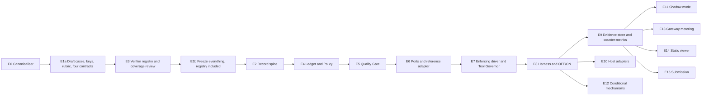

# Build Order — OutcomeFuse MVP

**Derived from:** [ARCHITECTURE-SPINE.md](ARCHITECTURE-SPINE.md) · [prd.md](../../prds/prd-OutcomeFuse-2026-09-04/prd.md)
**Date:** 2026-09-07 · **Audience:** the builder, and sprint planning

This is not a wish-list ordering. It is the order the architecture and the PRD's own evidence rules *force*, plus the places where that order is load-bearing and violating it silently destroys a claim.

---

## The constraint nobody would guess from the PRD alone

§8.2 and FR65 require the quality rubric and case answer keys to be **frozen, versioned and content-hashed before governor implementation begins**.

AD-6 requires one canonicalisation function to serve *every* hash in the system — contract identity, tool keys, progress fingerprints, rubric freeze, baseline freeze — with a specified, versioned normalisation, because the freeze tool runs **before the governor exists** and the two must still agree.

Put those together and the first line of code is decided for you:

> **The canonicaliser is built before the freeze. The freeze happens before the governor. Everything else follows.**

Build the canonicaliser second and the rubric you froze cannot be verified against the rubric the harness later reads — FR65's drift refusal fires on a rubric that never changed, and the only fix is re-freezing after you have seen the governor, which is precisely what §8.2 exists to prevent.

FR108 then adds a second, less obvious constraint in the same region. The verifier-coverage review has to run over four real contracts **before** the freeze, and it cannot run before the registry exists — so the registry is built *between* the drafting and the freeze, not after the record spine. That is why the epic numbering below is not the epic ordering: **E1a → E3 → E1b → E2**. Numbers are kept for traceability because the memlog and the PRD cite them.

---

## Epics

Cut positions refer to PRD §4.3 as amended on 2026-09-07.

### E0 — Canonicalisation and hashing · **protected · blocks everything**

Governed by AD-6.

One function, one specified and versioned normalisation, SHA-256 over canonical JSON. Serves contract identity (FR10), tool-call keys (FR29), progress fingerprints (FR27), result digests, rubric freeze (FR65), baseline freeze (FR64). Plus the one other admissible route: a **file-digest manifest** — sorted relative path and SHA-256 of file bytes, itself canonicalised and hashed by the same function — for artifacts that are source rather than structure, which is how E1b freezes the verifier tests and the baseline definition script at all.

**Every hashed artifact declares its route id**, so two freeze tools cannot silently pick different routes for the same artifact. Within the file-digest route, paths are POSIX-separated, NFC-normalised and byte-sorted, and text is digested with LF line endings — without that, a Windows freeze and a Linux freeze over the same tree disagree and fire the drift refusal this epic exists to prevent.

*Done when:* two independent processes — a freeze script and a runtime import — produce identical hashes for the same structure, including for `1.0` versus `1`; a file-digest manifest over the same tree hashes identically from either process and from either platform; and an artifact presented without a route id is rejected rather than defaulted.

### E1a — Draft cases, answer keys, rubric, contracts · **protected · must precede the governor**

FR57, FR59, FR64, §8.2, §8.5.

Author the four workloads' cases and answer keys; write the rubric; write the baseline definition; split the corpus into the **calibration set** and the **sealed evaluation set**. Author **one real Outcome Contract per workload** (FR108) — not a sketch, the contract you would actually run.

> Nothing here needs the governor to exist, and all of it becomes untrustworthy if written after it does. This is the cheapest work to defer and the most expensive to have deferred.

### E3 — Verifier registry and coverage review · **protected · runs before the freeze**

AD-7, F2 (FR7–FR12, **FR108**).

Safe-loading YAML under bounded size and depth, pydantic model, canonical hashing, the closed verifier registry with its fixed type→mode mapping, contract validation including FR9's unsatisfiability warning.

Every verifier is a **pure function of its declared arguments** — `citation-resolves` is handed the derived citable index by its caller rather than fetching it — which is why this epic can sit here at all: determinism, boundary and replay tests run against fixtures alone, needing neither the record spine nor a live run. The index is a **core-owned typed model** and is defined here with the registry; the driver builds one per run in E7 and appends its AD-6 hash before invoking any verifier, so the argument is shaped and logged rather than assembled ad hoc by whoever calls.

Then run the **coverage review** over E1a's four contracts: classify every intended criterion `E` / `N` / `A`, admit at most three deterministic additions for demonstrated gaps, and produce the per-workload verification-mode coverage report.

*Done when:* a contract naming an unregistered verifier is rejected; a mandatory criterion with no deterministic verifier cannot be declared mandatory; and every workload has a coverage report with its reference-backed and constraint-backed counts.

### E1b — Freeze · **protected · the point of no return**

FR65.

Content-hash and freeze, in **one operation**: cases, answer keys, rubric, contracts, verifier registry and its tests, and the coverage report. The tests and the baseline definition script are source rather than structure, so they freeze through E0's file-digest manifest route — the typed-model route alone cannot hash them.

> Splitting E1 in two is not bookkeeping. You cannot review verifier coverage before the registry exists, and you cannot freeze a rubric whose criteria draw their executable meaning from a registry that is still moving. The registry has to be built between the drafting and the freeze — which is why E3 sits here rather than after E2.

### E2 — Record spine · **protected**

AD-2, AD-8, AD-16.

Project-owned decision-record schema and `decision_reason` registry, both versioned. SQLite append-only writer against **one workspace database holding many runs**, rows hash-chained **per run**, run seal. Concurrency is imposed rather than assumed: `sqlite3` library version **≥ 3.51.3** asserted at store open and recorded in the manifest, **one writer per database file under an OS advisory lock taken at store open, with a second writer refused rather than retried** — an in-process lock is void the moment the harness forks a subprocess per case — `BEGIN IMMEDIATE` rather than the deferred default, an explicit busy timeout, `synchronous=FULL`, local storage only. The canonical per-decision event order. Run-state fold. Replay-equivalence oracle.

*Done when:* a synthetic event stream folds to the same run state twice; a mutated row breaks its run's chain detectably; opening against a library below 3.51.3 is refused; a second process attempting to open a writer on the same file is refused rather than blocked; and two concurrent runs writing to the same database produce two independently valid chains.

### E4 — Ledger, Policy, Loop Fuse · **protected**

AD-3, AD-4, AD-18, F1, F3, F5.

`verification_reserve` / `in_flight` / `spent` separation with hold-and-release. The FR2 precedence ladder, FR103 terminal mapping, FR104 registry, FR105 `quality_state`. Advisor protocol, `EvidenceRequest` sum type, fixed composition order, attribution decomposition. The FR17 floor-protection rejection in the Policy (AD-18). Progress fingerprint.

*Done when:* the FR103 nine-row mapping table passes as a test table, and a `low-value` proposal against an unmet mandatory criterion is rejected and recorded as a violation.

### E5 — Quality Gate · **protected**

F4 (FR19–FR26, FR94, FR98, FR105).

Deterministic criterion evaluation, binary verdict with qualifier, per-criterion breakdown, core-declared step classes driving FR98 cadence.

### E6 — Ports, reference adapter, conformance battery · **protected**

AD-1, AD-12, AD-15, F11, **FR107**.

Port protocols. `ModelPort` over LiteLLM. `ApprovalPort` with the scripted decider. Hand-rolled ReAct reference adapter. The conformance battery **including the out-of-band side-effect probe**.

> Build the battery here, not after the adapters. It is the specification the adapters are written against; written afterwards it becomes a description of whatever they already do.

### E7 — Enforcing driver, Tool Governor, failure posture · **protected**

AD-20, F6, §10 (FR85–FR91).

The enforcing driver. Canonical tool keys, run-scoped cache, exact-duplicate denial, side-effecting-tool exclusion (FR33), approval enforcement. Fail-open in the advisor registry, fail-closed in the driver, run-scoped registry lifetime.

**At the end of E7 the protected core runs.** Everything after this point is evidence, surfaces, or optimisation.

### E8 — Harness, manifest, OFF/ON benchmark · **protected**

AD-9, AD-10, F13, FR52.

Run manifest — including `data_class`, taken from the frozen case-set attestation with **no default** so an absent class refuses the run, and the retention profile that class selects, plus the verifier-registry version and hash, the coverage-report hash and the `sqlite3` library version, so that two manifest-identical arms cannot differ in registry, coverage or store. Preregistration record and its hash. OFF as an **adapter state** (FR52) so the baseline shares no governor code. The three-gate reportability predicate, whose accompaniment gate also refuses any workload result lacking its coverage report or the predominantly-constraint-backed label where it applies. Repeated runs, absolute pass counts, per-mechanism ablation (FR62), proof card (FR97).

*Done when:* an OFF/ON comparison on one workload produces a proof card, and a comparison with mismatched manifests is refused.

### E9 — Evidence store and counter-metrics · **protected**

AD-19, AD-21, FR69, FR70, FR71, FR99, NFR12, §3.3.

Evidence store with the driver as sole writer. Blind-review packet renderer, structurally denied the verdict. Tool-suppression accuracy by re-execution. Compression fidelity. Marginal-value denial reporting. The `mvp-synthetic-v1` retention lifecycle — the campaign *is* the workspace, the driver appends a **`run-closed`** event that *is* the run's terminal row and therefore its seal, campaign seal is a **one-shot harness command** refused while any run is unsealed, and the sweep appends **`run-abandoned`** to whatever is left — and the FR109 refusal to persist anything other than `synthetic`, **evidence and decision log alike**, with `replayed` inheriting the class of the run it replays.

> This epic is what makes the headline falsifiable. It is protected for the same reason F12 is: without it the savings number is unfalsifiable, and §8.3 forbids publishing it.

*Done when:* the access matrix is enforced rather than documented; every completed run is sealed by an appended `run-closed` event and the sweep appends `run-abandoned` to the rest, with `max(run_closed_at) ≤ campaign_sealed_at` asserted at seal, sealing twice refused, sealing while a run is unsealed refused, and a writer refused against a sealed store; a deterministic test performs a **whole-run deletion** that removes generated temporary copies and writes a content-free receipt to the campaign retention manifest without touching any run's chain; and persistence is refused for both tiers on any class other than `synthetic`. **No evaluation-set run may begin before E9 is done.**

### E10 — Host adapters · **first two protected; third is cut position 2**

LangGraph, then Microsoft Agent Framework. Each admitted only by passing E6's battery. The third adapter (OpenAI Agents SDK, pre-1.0, pinned exactly) is built only if schedule holds.

### E11 — Shadow mode · **protected**

AD-11, AD-21, F10, FR46–FR49, FR96, FR106, FR109.

Shadow driver that alters nothing, fulfils no spending `EvidenceRequest`, does not call the `ApprovalPort`, marks first divergence. Synthetic and replayed workloads only — and because a replayed run **inherits the `data_class` of the run it replays**, replaying captured production traffic is refused rather than admitted as synthetic, evidence *and* decision log alike.

### E12 — Conditional mechanisms · **cut positions 5–9**

FR32 semantic dedup (5), F8 Model Governor (6), F7 Context Governor (7), F9 Preflight Planner (8), FR20 rubric signal (9). Each an advisor behind the registry, so cutting one is deregistering it.

### E13 — Gateway metering · **cut position 10**

F15, AD-13. APIM on a tier that supports `llm-token-limit`. Reconcile the combined count against governor-side; label self-reported on fallback.

### E14 — Static viewer · **cut position 1**

F14, AD-17. Jinja2 generator, autoescaping explicitly on, reads log and proof card only.

### E15 — Submission artifact · **protected**

F16. Every figure traceable to an evaluation-set run; depends on E2, E8 and E9, never on E14.

---

## Where the order is load-bearing

| Ordering | Why violating it costs you a claim |
| --- | --- |
| E0 before E1a | Freeze hashes and runtime hashes disagree; FR65 drift refusal fires on an unchanged rubric |
| E1a before E3 | There are no real contracts to run the FR108 coverage review against, so registry breadth is guessed |
| E3 before E1b | The rubric freezes over a registry that is still moving, so the criteria are not actually frozen |
| E1b before E2–E7 | The rubric was written by someone who had seen the optimizer; §8.2's whole defence evaporates |
| E6 before E10 | The conformance battery becomes a description of the adapters instead of a specification for them |
| E8 before any published number | No manifest, no preregistration, no admissibility check — the figure is unciteable under §8.4 |
| E9 before the headline | FR62/FR70 accompaniment is unavailable, so §8.3 forbids publishing the figure at all |
| E9 before any evaluation-set run | Evidence accumulates with no enforced lifetime, and NFR12's declared period becomes retrospective |
| E2 before everything downstream | FR5 forbids a decision taking effect before it is recorded; there is nothing to record into |

---

## Where the cut order actually bites

The declared cut order removes **E12, E13, E14 and the third adapter** without touching anything the claim rests on — which is the point. What it cannot remove is E0, E1a, E3, E1b, E2, E8 and E9: the evidence apparatus is as protected as the runtime, because §8 makes the claim itself a deliverable.

> The uncomfortable reading: if the schedule collapses to the protected core, you ship a governor with exact tool deduplication, a sufficiency stop and a loop fuse — and the per-mechanism ablation in E8 will show precisely how much of the saving came from deduplication alone. §11.2's "Attribution" risk is the one the cut order makes *more* likely, not less.
