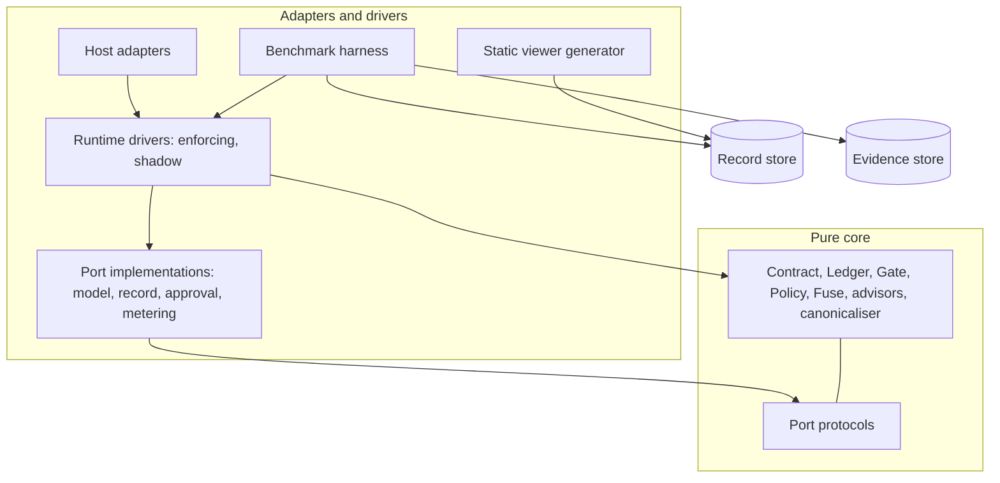
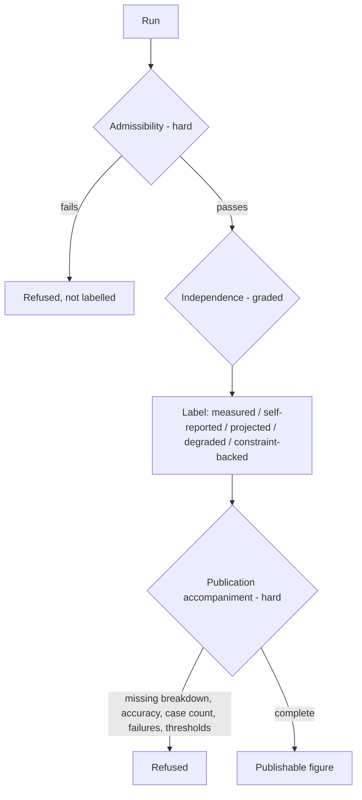

# Solution Design — OutcomeFuse

**Read [ARCHITECTURE-SPINE.md](ARCHITECTURE-SPINE.md) for *what* was decided. This document is *why*, *what else was on the table*, and *what each choice costs.*** The spine is a machine contract and deliberately omits reasoning; a terse rule with its rationale attached is no longer terse. The rationale still has to live somewhere, or the first maintainer who finds an invariant inconvenient will delete it.

---

## 1. Executive summary

OutcomeFuse is a runtime policy that asks, before every unit of AI work an agent proposes, whether that unit is worth paying for given a declared quality contract. It is not an agent framework and it is not a dashboard. It wraps an existing tool-using loop, and its deliverable is a *cheaper completed run* — not a report about one.

Architecturally it is three things stacked.

**A pure decision core.** Contract, Ledger, Quality Gate, Policy, Loop Fuse, five mechanism advisors, a closed verifier registry and one canonicalisation function. No I/O, no clock, no network, no randomness. Everything worldly is a port defined by the core and implemented outside it — ports and adapters, hexagonal, unremarkable in itself.

**An append-only decision log as the system of record.** This is the choice that does the work. Run state — ledger position, quality state, iteration count, decision history — is a *fold over the log*, never a second mutable structure kept in sync with it. The PRD requires that no decision take effect before it is recorded (FR5), that a run be reconstructible without re-invoking a model (FR6, FR55, FR68), and that each mechanism's contribution be ablatable (FR62). Those are write-ahead logging, event sourcing and registry composition respectively. Adopting the paradigm gets all three as consequences rather than as three features to build. Replay, audit and the benchmark harness become three readers of one log.

**An evidence apparatus that is as protected as the runtime.** OutcomeFuse's deliverable is partly a *claim* — "the same task, to the same declared bar, for measurably fewer tokens, net of governor overhead, with no silent quality substitution." A claim that cannot be falsified is not evidence, so PRD §8 makes measurement standards normative. The architecture therefore treats the run manifest, the preregistration record, the sealed evaluation set, the separate evidence store and the reportability predicate as load-bearing structure, not tooling. Around a third of the build is apparatus whose only job is to make the headline number capable of being wrong.

The whole thing runs in one OS process on a developer workstation, plus one managed slice: token metering through Azure API Management, so the headline figure is measured by something other than the system being evaluated.

---

## 2. The forces

Four tensions shaped every decision that follows. None has a clean resolution; each was traded deliberately.

**Wrap, don't re-architect — against decide-before-every-step.** FR50 promises a team can adopt this without restructuring their agent. But the policy must see and rule on *every* step, including termination. Those pull opposite ways: the cheapest integration (wrap the model client, wrap the tool registry) cannot guarantee that a *stop-because-sufficient* is honoured, because the host still owns its own loop exit. The most reliable integration (the governor drives the loop) is exactly the re-architecture FR50 says isn't needed.

**Terse and fast — against provable and honest.** One month, solo. Every structural guarantee is code that isn't a mechanism. But the PRD's §8 evidence standards are requirements, not aspirations: unfrozen rubrics, unmanifested runs and unpublished failures are all disqualifying. Discipline is free to write and worthless under schedule pressure; structure costs days and survives a bad week.

**Seven mechanisms — against a one-month solo build.** §4.3 accepts this openly and mitigates with a declared cut order. That only works if a cut is *mechanically executable*, which forces mechanism modularity to be a structural property rather than a coding convention.

**The claim is a deliverable.** §3.3's counter-metrics exist because the primary metric has a perverse optimum: the system that stops earliest always wins on savings. False-sufficiency rate, tool-suppression error rate and governor overhead share are the guards, and each of them requires infrastructure the runtime itself does not need — blind review, suppressed-call re-execution, overhead attribution. The evidence apparatus is not overhead on the product; for a large part of the value it *is* the product.

---

## 3. The shape

### Layers and the direction of dependency

Dependencies point inward only. No host-framework type may appear above the adapter layer, which is what keeps NFR8 domain neutrality and FR51 multi-framework support from being a promise about discipline.

### The flow of one decision

The host adapter *proposes* a step. The driver appends `decision-proposed`, asks the Policy, and the Policy consults advisors. An advisor returns either a proposal or an `EvidenceRequest` — a typed request for work it cannot itself do, because advisors are pure and cannot call ports. The driver fulfils the request through a port, records the outcome, and re-enters the advisor with it. Budget is *held* before it is spent, the decision is recorded, then the verdict goes back to the adapter, which applies it. The outcome is observed, spend is settled against the hold, and where the step could have changed the candidate result the Quality Gate runs and its verdict is appended.

The sequence is fixed in AD-2 rather than left to implementers, because two compliant implementations must produce the same event stream for the same run or replay equivalence means nothing. Replay equivalence is defined narrowly and honestly: same decisions, same reason codes, same terminal reason, same ledger totals. **Byte equality of model output is not required and is never claimed.**

### Where state lives

| State | Home | Lifetime |
| --- | --- | --- |
| Run state (ledger, quality state, iterations, history) | Derived by folding the decision log | Reconstructible forever |
| The decision log | SQLite, one canonical database per benchmark workspace holding many runs, hash-chained per run | 180 days from campaign seal, archived or deleted per workspace (NFR12) |
| Deliverables, evidence capsules, raw tool output | Evidence store, one directory per run, access-controlled, driver writes / harness reads | 60 days from `run_closed_at`, deleted as a whole directory — see §5 |
| Raw prompts, tool args, tool results | Transient working set inside ports and three named core operations | The decision that needed them |
| Tool result cache | Run-scoped, process-local | The run |
| Advisor registry | Run-scoped, built from the manifest | The run |

Nothing durable holds raw content except the evidence store, and nothing reads the evidence store except the harness.

---

## 4. The decisions that matter, and what they cost

### AD-1 — Mediated control boundary

**Alternatives.** *(A) Interception only* — wrap the model client and tool registry, let the host keep its loop. Cheapest integration, truest to FR50's promise. Rejected because the sufficiency stop becomes a *signal the host may swallow*: an agent that ignores it keeps iterating and the run is refiled from `stop-sufficient` — the product's headline event — to `halt-exhausted`. FR98's requirement that the gate run before any terminal halt cannot be guaranteed by a party that does not own the halt. *(B) Governor drives the loop* — makes FR1, FR23 and FR98 trivially true, and is exactly the re-architecture FR50 forbids; it also breaks the "wrap your agent on a Tuesday afternoon" adoption story.

**Why mediated.** A narrow port where the adapter *proposes* and *applies* subsumes both: interception and loop-driving become adapter strategies rather than competing architectures.

**Cost.** Enforcement is now **cooperative**. The governor decides; the adapter applies. An adapter that executes a denied call while recording a clean pause produces a plausible, internally consistent and entirely false audit trail — and every §8 claim then rests on it. That forced two pieces of unscoped work: the AD-15 conformance battery, and an out-of-band side-effect probe in which scripted tools assert for themselves whether they were invoked. **A decision record cannot detect the one failure it is the evidence for.** This became FR107 in the PRD.

### AD-2 / AD-16 — Log as system of record, one workspace database

**Alternatives.** *Record-as-byproduct* (mutate state, write a log alongside) makes FR5's ordering a discipline and forces two representations of run state to be kept honest by hand. *JSONL as the store* is structurally append-only — genuinely better on integrity — but turns FR54 queryability and the harness's cross-run joins into hand-written scans. *JSONL-as-truth with a derived SQLite index* is the strongest story and one more moving part than a one-month solo build should carry. *One database file per run* was the earlier shape and was dropped: it makes FR54's cross-run queries an attach-and-union exercise, and its only real attraction — retention by deleting a file — was solving the wrong problem, since retention divides by sensitivity (redacted log versus raw evidence) and not by which run produced a row.

**Cost.** A shared file means concurrency is now the project's problem, and WAL does not solve it for you — it surfaces contention as `SQLITE_BUSY` rather than queueing behind a lock. So the discipline is imposed rather than assumed: **one writer per database file under an OS advisory lock taken at store open, and a second writer refused rather than retried** — an in-process lock is void the moment the harness forks a subprocess per case, which is a perfectly legal implementation of the same epic — `BEGIN IMMEDIATE` rather than the deferred default so a transaction cannot upgrade mid-flight and lose its busy retry, an explicit **busy timeout**, and `synchronous=FULL`, because WAL with `NORMAL` syncs only at checkpoint and forfeits durability on power loss. The file sits on **local storage only** — WAL's shared-memory wal-index does not work over a network filesystem. And the `sqlite3` library version is asserted at open to be **≥ 3.51.3** and recorded in the manifest: the WAL-reset corruption bug present from 3.7.0 through 3.51.2 triggers on exactly this workload, concurrent writers or checkpointers on one file. All of that is a second serial path on top of AD-3's, accepted deliberately: correctness of the record outranks harness throughput.

SQLite's append-only property is also *writer discipline*, not a structural fact. That is the accepted weakness of the choice, and it is mitigated rather than denied: each row carries the hash of its predecessor **within its own run**, so every run is an independent hash chain inside the shared file, and that run's terminal row hash is its **run seal**, cited by every proof card. Chaining per run rather than per file is what keeps interleaved writes from making one run's integrity depend on another's.

What the chain proves is worth bounding honestly, because it is easy to oversell. `VACUUM` and checkpointing rewrite pages but never row values, so neither breaks it. But a seal that lives only inside the file it protects proves nothing against someone rewriting the file and recomputing the chain: **tamper-evidence is load-bearing only because every proof card carries the seals of the runs it compares, outside the database.** It establishes neither authorship nor time. What it makes detectable is a selective edit — and that is what §8 actually needs, given that the party asserting the timestamps is the party §8.1 names as interested.

### AD-3 — One decision lane per run

This closes a hole neither the PRD nor any single mechanism catches. LangGraph and Microsoft Agent Framework both issue parallel tool calls. Two concurrently proposed steps can each pass affordability against the same `remaining` and jointly breach the ceiling FR2 ranks above nearly everything — with no individual rule violated by either.

**Alternatives.** An atomic compare-and-set ledger permitting concurrent decisions fixes the arithmetic but leaves the log partially ordered, and a partially ordered log cannot be replayed deterministically. Forbidding host parallelism is a re-architecture demand FR50 forbids.

**Cost.** Decision latency now sits on a serial path. A host batching ten parallel tool calls receives ten sequential verdicts before any execute. NFR1 must therefore be measured **against batch width**, not per step alone — a reporting obligation that would otherwise have been discovered during the benchmark, at the worst possible time.

### AD-4 — Advisors propose, driver acts, Policy decides, Ledger writes

Four single writers. The failure this prevents is subtle and entirely constructible: the Tool Governor debits its own cache-miss spend while the Context Governor returns a capsule and lets the caller debit. Both obey FR4 as written. But FR15's per-mechanism attribution now carries two meanings, and FR62's ablation compares numbers computed differently — which invalidates the only thing that makes a headline figure publishable.

Two refinements were forced during review:

- **`EvidenceRequest`.** Pure advisors as first specified made FR20 (rubric), FR37 (compression), FR41 (complexity/confidence), FR43 (envelopes) and FR98 (gate executions) unimplementable — none of them can run without a port call. The resolution keeps purity: an advisor returns *either* a proposal *or* a typed request; the driver is the sole performer of port calls, records the outcome, and re-invokes. Replay then becomes literally the act of feeding recorded outcomes back into a pure function.
- **Attribution is a decomposition, not a winner.** Where several mechanisms contribute to one step's avoided spend, all are credited in a decomposition summing to the total. A tie-break electing a single causer would make FR62's breakdown a function of the tie-break rather than of the mechanisms.

**The payoff.** *Disabled means not registered.* No mechanism carries an `if enabled` branch, so an FR62 ablation is a registry change that is byte-identical to having cut the mechanism. NFR10 and §4.3's cut order become mechanically executable rather than aspirational — which is the entire mitigation for the schedule risk.

### AD-7 — A contract executes no code

The obvious implementation of FR8's "executable deterministic verification method" is a contract naming a Python import path, or carrying an expression that gets evaluated. **That is remote code execution wearing a configuration costume**, in a product whose position is that platform teams hand contracts to agent owners. It also breaks FR10: a contract is immutable for a run and carries a stable hash, but a verifier that is a *reference* to code can change while the hash does not, so the attestation would cover something never pinned.

**Alternative.** A sandboxed expression language is more expressive and makes the project the owner of a sandbox. Not affordable solo in a month, and a bad thing to own badly.

**Cost.** A criterion for which no registry verifier exists cannot be mandatory. That is FR8's own rule rather than an additional restriction, but it bites in a specific and dangerous way: FR8 makes a shortfall **silent rather than loud**. An inexpressible criterion does not break a run — it demotes to advisory, every gate still reports a pass, and the quality floor shrinks without anything visibly failing. A registry that is too narrow therefore does not announce itself; it quietly makes the product's central guarantee cheaper to satisfy.

**So breadth is proven before the freeze, not assumed.** Seven types remain the default. One real Outcome Contract is authored per committed workload and every intended criterion is classified *expressible today*, *new deterministic type demonstrably needed*, or *advisory* — with the semantic criteria that are easiest to overlook (root-cause correctness, query-result correctness, code-location correctness, evidence completeness, conclusion support) reviewed explicitly rather than left to whoever is writing the contract that afternoon. A demonstrated gap admits **at most three** additions, each deterministic, declarative, I/O-free and fixed in mode by the registry; `semantic-match` and `llm-judge` remain barred. Each workload publishes a coverage report counting reference-backed versus constraint-backed *mandatory* criteria, because FR21's run-level qualifier hides how much of a floor is substantive rather than structural, and a workload with zero reference-backed mandatory criteria may be evaluated but may not be used to imply that OutcomeFuse independently established semantic correctness. The registry, its tests and that report are content-hashed **in the same operation as the rubric** — a frozen rubric whose criteria take their executable meaning from an unfrozen registry is not frozen. Freezing the *tests* is what forced a second admissible hashing route into AD-6: test files are source rather than structure, so a single typed-model route made the clause literally unsatisfiable. They hash through a declared **file-digest manifest** — sorted relative path plus SHA-256 of file bytes, itself canonicalised and hashed by the same function — and so does the baseline definition script. Two routes create their own hazard, so each is closed in turn: **every hashed artifact declares which route it takes**, and the file-digest route pins **POSIX separators, NFC normalisation, byte-sorted order and LF line endings**. Without the route declaration two freeze tools can hash the same coverage report differently; without the normalisation a Windows freeze and a Linux freeze disagree over the same tree — and either produces exactly the spurious FR65 drift refusal AD-6 exists to prevent.

The freeze is only buildable at all because **a verifier is a pure function of its declared arguments**. `citation-resolves` is *handed* the run's derived citable index by its caller rather than fetching it, so every verifier is testable against fixtures alone — needing neither the record spine nor a live run, which is what lets the registry and its tests exist before either. The index is itself pinned, because an argument with no declared shape moves the divergence rather than closing it: it is a **core-owned typed model built by the driver**, canonicalised and hashed under AD-6, with its hash **appended before any verifier is invoked**. A driver deriving it from raw payloads and a gate deriving it from log-borne hashes would otherwise reach different verdicts, and therefore different terminal reasons, on the same run — and AD-2 says anything not in the log did not happen. Two of seven verifier types are `reference-backed`; the rest are `constraint-backed`, which §8.2a already names as the honest limit of the gate.

### AD-13 / no streaming — the model seam

LiteLLM sits *behind* a project-owned `ModelPort`. Making LiteLLM itself the port puts a third party on the most load-bearing seam in the system and makes FR79 a reconciliation between two numbers the project did not compute — with no way to say which is wrong when they disagree. Hand-writing a provider adapter each is more code than the window allows.

Streaming is barred on any run that produces a reportable figure, on a verified platform fact: APIM's `llm-token-limit` **estimates both prompt and completion tokens when `stream: true`**. FR79 would then reconcile two guesses, FR80 would force the self-reported label anyway, and F15 would buy nothing. Streaming survives as a demo affordance structurally outside the evidence path; it costs nothing in the submission because FR72 replays recorded runs rather than streaming live.

### AD-11 — Shadow mode is a driver, not a flag

A mode flag puts a shadow branch inside the Policy, inside every mechanism, and — because FR91 exempts shadow from fail-closed — **inside the fail-closed paths**. That places a conditional in the most safety-critical code in the system, on the branch that must never fire in production and is therefore the least exercised by tests.

As a separate driver, the Policy is unchanged and always decides as if enforcing; FR91's exemption is one statement in one place; and FR96's first divergence is a fact the driver *observes* rather than something a mechanism must compute and could compute differently.

**Cost.** During a shadow run the real ledger and an estimated counterfactual ledger both exist, so the estimated one must be structurally barred from admissibility. It is.

### AD-17 — The viewer is generated, not served

**Alternatives.** Streamlit is the fastest interactive build but leaves a running server, so FR77's "no path to influence execution" degrades to a discipline. React with Vite looks best and spends days on the component that sits *first* in the cut order.

A generated self-contained HTML file makes FR77 structural — no live process exists that could touch execution — is the cheapest of the three by a wide margin, and hands to a judge as a file with no server to stand up. Its known limit: embedding the record inline does not scale to large production runs. Acceptable because NFR9 confines MVP evaluation to synthetic cases.

### Three host adapters, not two

The recommendation was two. FR51 requires only two *dissimilar* implementations, and each committed adapter costs a wrapper, conformance passage, four workloads of tools rebound, a frozen FR64 baseline configuration and a share of FR100's failure cases. A third multiplies the benchmark matrix without adding an argument. `openai-agents` is also still 0.22.0, pre-1.0 with no stability statement — a poor thing to freeze a published baseline against.

Three were committed anyway, by explicit decision. The trade is made reversible rather than hidden: the third adapter is now **cut-order position 2** in the PRD, and the dependency is pinned exactly rather than range-specified.

---

## 5. How the invariants defend the claims

This is the least visible property of the system from the spine. Four invariants together convert the savings figure from an assertion into something that can be shown to be wrong.

**AD-9 — every run opens with a manifest, and evaluation runs carry a preregistration hash.** The manifest fixes what a "run configuration" *is*: mode, `data_class` — supplied by the **frozen case-set attestation**, with **no default**, so a run whose class is absent is refused rather than assumed benign — and the retention profile that class selects, contract hash, rubric hash, verifier-registry version and hash, coverage-report hash, frozen baseline hash, case-set identity and calibration-versus-evaluation, model ids and provider versions, pinned cost-table version, route, streaming state, enabled-mechanism registry, adapter version, governor version, `sqlite3` library version, seed. The registry and coverage hashes are there so that two manifest-identical arms cannot differ in what their criteria actually meant. Without one artifact owning that definition, the harness, an adapter and the viewer each decide it independently, and the disagreement surfaces as an unexplainable difference between two runs believed identical.

The preregistration record is the sharper part. §8.5 seals the evaluation set until targets and counter-metric thresholds are recorded, and FR102 requires execution to follow preregistration. A timestamp asserted by the interested party proves nothing; a **hashed, timestamped preregistration artifact whose hash appears in every evaluation run's manifest** anchors the ordering to content. The harness refuses any comparison in which execution precedes preregistration.

**AD-10 — reportability is one predicate, evaluated in exactly one place.** Three gates:

Admissibility is hard and structural: non-streaming, adapter conformance passed, manifest complete, and for a headline claim, drawn from the sealed set with the preregistration hash present. The two arms of a comparison must be **manifest-identical except for the run id and the fields the comparison exists to vary**. Field-by-field comparison closes the hole where a baseline arm on cost table v3 is legally published against a governed arm on v4.

Independence is *graded*, deliberately. An earlier, over-tight version refused a run when gateway metering was unavailable — which contradicts FR80, where the PRD downgrades the independence label rather than discarding the run. Over-strictness is as damaging as over-looseness: it discards evidence the PRD wanted kept.

Publication accompaniment is hard, and it is the gate that closes the most likely real-world failure: a bare savings number shipping without the measurement that exists to refute it. The harness refuses to emit a headline without its per-mechanism breakdown (FR62), a tool-call reduction without tool-suppression accuracy (FR70), a workload below its minimum case count (FR59), a gross figure as headline (FR61), successes without failures (FR63), a counter-metric without its preregistered threshold, or a workload result without its verification-mode coverage report and the **predominantly constraint-backed** label where AD-7's condition holds.

One structural detail carries disproportionate weight: **FR52's OFF is an adapter state, not a driver.** The baseline arm has the governor out of the call path entirely, so it shares no governor code with the governed arm and its latency is not governor-inflated. §8.1's baseline-fairness commitment becomes structural instead of a promise to be careful.

**AD-16 — the per-run hash chain and the run seal.** Every proof card cites the seals of the runs it compares, and that is not incidental packaging: a seal that never leaves the database it protects is worth nothing against a rewrite-and-recompute, so the proof card is where the guarantee actually lives. Given §8.1's own observation that the baseline is defined by the party who benefits from it losing, self-asserted timestamps are the weakest link in the whole apparatus. A chain does not make falsification impossible, and it establishes neither authorship nor time; it makes a selective edit leave a mark. Chaining is per run rather than per database file, so a run's seal remains meaningful in a store that other runs are writing to concurrently.

**AD-19 — the evidence store is separate from the decision log, and its lifetime is declared.** This one is easy to miss and fatal to get wrong. FR69's blind review must compute false-sufficiency rate — the counter-metric that is the direct inverse of the headline claim. If the blind-review packet were rendered from the same store carrying the gate verdict, the decision record and the manifest, the reviewer's independence would be one careless join away from gone, and the counter-metric would be silently invalid rather than visibly broken. The renderer is therefore **structurally denied** access to the verdict, the record and the manifest. The store also holds what FR70 needs to re-execute suppressed calls and what FR71 needs to measure compression fidelity — both of which require the raw output the decision log is forbidden to hold.

Because it holds the rawest content in the system, its lifetime is now stated rather than left to be settled later. A **campaign is a workspace** — the two words name one thing, and the workspace database is its record. Retention profile **`mvp-synthetic-v1`**: raw evidence expires 60 calendar days after `run_closed_at` and is deleted as a **whole per-run directory**, not selectively; redacted decision records and proof artifacts are kept 180 days from campaign seal. Run closure is an **appended event, never an update**: AD-16 forbids `UPDATE`, so `run_closed_at` cannot be stamped onto a row that already exists, and an unsealed run has no terminal row to stamp it onto in the first place. The driver appends a **`run-closed`** event which *is* the run's terminal row and therefore its seal; a run without one is **unsealed**, and the harness's sweep appends **`run-abandoned`**, which both seals it and gives it an expiry. Without that sweep, abandoned evidence never acquires one and lives forever. No column is ever mutated, and expiry is never read from a filesystem modification or access time, which any copy or backup would reset.

**Campaign seal is a harness command, executed once**, refused while any run is still unsealed; after it, the store refuses to open a writer, so no run can join a sealed workspace. `max(run_closed_at) ≤ campaign_sealed_at` is asserted at seal. That is what makes the redacted tier outlive the raw tier it describes — the ordering is owned by one command rather than left to whichever component seals first, and a workspace that sealed early and then admitted a run would have inverted the two tiers this section declares safe by definition. **There is no per-run extension.** Evidence that expires before an FR69 / FR70 / FR71 assessment completes is regenerated by re-running the frozen case, which is affordable precisely because the case is frozen; the alternative is a retention rule that becomes negotiable at exactly the moment someone wants it to be. Deletion writes a content-free receipt — run id, evidence manifest hash, profile, scheduled expiry, deletion time, result — to a separate append-only campaign retention manifest, and **never into any run's hash chain**, so no act of retention can alter a seal. This is logical deletion appropriate to synthetic data and is not cryptographic erasure.

Access is written down as a matrix rather than left as a convention, because "the renderer must not join against the verdict" is exactly the kind of rule that survives review and dies in the third week of implementation: the driver writes its own run only; the harness reads and generates the FR69–FR71 artifacts; the retention command may delete and set manifest status and nothing else; the blind-review renderer reads evidence and the contract but not the verdict, record or manifest; verifiers, host adapters, the static viewer, the submission generator and the model and approval adapters get nothing.

Together: AD-9 fixes what a run *is*, AD-10 decides what may be *said* about it, AD-16 makes the record *tamper-evident*, and AD-19 keeps the falsifying measurement *independent of the thing it falsifies*. Remove any one and the headline number reverts to an assertion.

**An honest caveat.** None of this removes the conflict of interest. The same person writes the rubric, builds the optimizer, and — at MVP scale — is the blind reviewer's only available body. Freezing by hash, sealing the evaluation set, blinding the packet and chaining the log reduce the bias and make cheating visible in the record. They do not make the builder disinterested, and the PRD says so.

---

## 6. Security and governance posture

**Contracts are data, and only data (AD-7).** The threat is not hypothetical: the product's adoption story is platform teams handing contract files to agent owners, which is a supply chain. Three closures make "no code execution" real rather than nominal.

1. **Closed verifier registry.** No import path, expression or callable reference crosses the contract boundary. Validation rejects a mandatory criterion whose verifier type is not registered.
2. **Safe parsing.** Contracts load through a safe loader only — no tag resolution, no object construction — under bounded input size and nesting depth. The named RCE here is one default argument away in the obvious YAML call. Parsing precedes the run manifest, so a rejection is recorded against the contract's *content hash* rather than against a run that never started.
3. **No verifier performs I/O, and none reads run state.** A verifier is a **pure function of its declared arguments**: `citation-resolves` is *handed* the run's **derived citable index** — identifiers, citation targets, content hashes — by its caller, and never fetches it, never touches the evidence store. That index is a **core-owned typed model built by the driver**, canonicalised and hashed under AD-6 with its hash appended **before any verifier is invoked**, so it is a shaped and logged decision input rather than whatever the caller happened to assemble. A verifier that could reach the network would be an exfiltration channel straight through AD-5's redaction boundary, and would break core purity and FR68 replay simultaneously. Regex verifiers run bounded against ReDoS.

**Redaction at the port, not at the sink (AD-5).** Redact-at-the-sink is simpler for mechanism authors, but it makes every in-memory structure sensitive, lets a stack trace or debug log leak, and reduces NFR5 to something a person must remember at every write site. Redacting at the port means the core **cannot leak what it never held**. The exception is narrow and named: canonicalise-to-key, compress-to-capsule and verify-criterion cannot function without raw content, so raw content is a *transient working set* inside declared operations, never a durable one. Evidence capsules preserve facts verbatim (FR38) and therefore live in the evidence store, with only their reference and hash in the log.

**Prompt injection is bounded, not eliminated.** Tool output reaches model-derived advisors — the FR20 rubric signal, FR22's advisory tool-quality signal, the marginal-value estimator — so poisoned content could try to induce an early sufficiency stop, which is precisely the attack this product's incentives invite. The existing architecture bounds it without new machinery: FR20 makes deterministic criterion-level validation the authoritative gate, FR22 bars the model-judged signal from altering a verdict, and the closed registry means no contract-declared check can be steered by tool content beyond its declared extraction. Stated here so the bound is maintained deliberately rather than by accident.

**Untrusted record content reaching a third party (AD-17).** The viewer renders decision-record content into HTML handed to a judge. Jinja2 autoescaping is **opt-in, not the default**, so it is enabled explicitly at environment construction. The generator reads the decision log and proof card only, never the evidence store, closing the in-spec path from raw customer content to an externally distributed file.

**Human control is enforced and bounded (AD-12).** Approval is a real port. Its MVP implementation is a scripted decider driven by the case definition — approve, deny, never respond — because FR100 requires deterministic timeout cases under both postures, and a blocking interactive prompt would make them untestable without a person sitting in front of a harness whose entire value is reproducibility. FR89's fail-closed path is therefore exercised rather than asserted.

An earlier version of this decision defined "unavailable" at the port as *either* the decider being unreachable *or* it not responding within `approval_timeout`. That was a defect, and it is corrected. The two are distinct states with different routes. **`channel-unavailable`** — the adapter cannot accept or create the request, or loses the decision channel of one it had accepted — routes to FR89 fail-closed. **`no-response`** — the request was accepted, the channel stayed up, no decision arrived in time — routes to FR95's contract-declared `on_timeout`. Collapsing the second into the first sends an ordinary timeout to fail-closed, which sits **above** the approval gate in FR2's ladder: the run's terminal reason changes, and so does what the caller receives. Recorded here because a conflation of two states that merely *look* alike at a port is exactly the class of bug that reads as correct in review and only surfaces as an inexplicable terminal reason in a benchmark.

**Non-synthetic data is refused, never inherited (AD-21).** `mvp-synthetic-v1` is a retention profile for data the builder authored, and it is admissible for **`synthetic` only**. Nothing about it is safe for production, confidential or customer traffic, so the runtime **refuses to persist — evidence and decision log alike** — rather than falling back to the MVP rule, until a separate production-data governance profile exists. The refusal keys on the class being **anything other than `synthetic`**, not on a `non-synthetic` label, because **`replayed` inherits the class of the run it replays** — replaying captured production traffic does not launder it — and a label-keyed refusal would let `replayed` walk straight past the one check that exists to stop it. Refusing only the evidence would be the narrower version of the same failure: the decision record would persist under AD-16 with no permitted profile governing it, and NFR12 would be unmet by a quieter route. The profile must settle — one that settles tenant and use-case partitioning, storage location, encryption in transit and at rest, workload and operator identity, role-based read/write/delete, legal classification, retention by data class, deletion SLA and verification, backup and replica deletion, incident handling, audit access and export restrictions, and whether specific raw fields may be persisted at all. Refusal rather than fallback matters for a reason worth stating plainly: the failure mode it forecloses **requires nobody to decide anything**. Shadow mode is the adoption path, someone points it at a real workload, and the raw prompts and tool results of live traffic land in a store whose only declared rule was written for synthetic data. No one approves that; it just happens. A default that inherits is a default that will be inherited, which is what makes it the likeliest way this system acquires a compliance problem. FR106 stands until the production profile does.

**The floor is protected by the Policy, not the estimator (AD-18).** FR17's marginal-value estimator is explicitly pluggable, and Q7 admits its quality is unknown. If the floor-protection carve-out lived inside it, swapping the estimator would silently delete the one rule §1.5 calls non-negotiable. So the estimator may only ever *propose* `low-value`; the **Policy** rejects any such proposal against an unmet mandatory criterion, and records the attempt — which FR99 then reports as a violation rather than a saving.

**Failure posture is placed, not chosen per site (AD-20).** Fail-open is a property of the *advisor registry*: an advisor that raises is deregistered for the run, execution continues, a `degraded` event names it. Fail-closed is a property of the *driver*: gate-verdict unavailability, ledger-state loss and approval-channel unavailability terminate through the FR2 ladder. Two consequences worth stating: **degraded is not disabled** — a degraded run is labelled, never silently equivalent to a clean one — and the registry is **run-scoped**, so a transient failure in one repeat cannot quietly degrade every repeat that follows it in the same process.

---

## 7. What we deliberately did not decide

Each of these is deferred with a condition, not waved away.

| Deferred | Why it can wait |
| --- | --- |
| Managed-service deployment beyond the APIM metering slice | The MVP is in-process by design (§4.2). A hosted governor is the production story; the demo does not need it and building it would consume the mechanism budget. |
| Persistent / cross-run tool cache | Looks like a free win and is not. It would make FR68 re-executability depend on cache warmth, make two supposedly identical runs differ, and put NFR6 tenant partitioning on the hottest path in the system. Revisit when there is a tenant-partitioned key and an answer for FR64/FR68 honesty under varying cache state. |
| Multi-process or distributed governor | AD-3's single lane is an explicit *per-run, in-process* guarantee. A distributed ledger with the same properties is a different design; nothing here forecloses it. |
| Contract authoring surface, templates, eval-suite import, versioning UI | Out of MVP scope. The constraint any future surface must respect is already fixed: AD-7's closed registry. |
| Learned marginal-value estimation | The estimator is pluggable behind AD-4 precisely so this can arrive later. Its floor-protection rule is not pluggable and lives in the Policy. |
| Live production traffic shadowing | FR106 confines MVP shadow evidence to synthetic and replayed workloads. Shadow is the adoption path, not MVP evidence. |
| OpenTelemetry export | Verified 2026-09-07: the GenAI semantic conventions are still Experimental, have moved to a repository with **no published releases**, and the token-usage attributes are marked Development. FR104 promises a published reason code keeps its meaning; delegating that to an unreleased external spec lets a third party revoke it. AD-8 keeps the internal schema independent, so adopting the conventions later is an additive mapping. |
| Production ground truth without hand-authored answer keys | PRD Q9. The gate's authority rests on synthetic keys; AD-7 makes the limit explicit per contract rather than pretending to solve it. |

---

## 8. Known risks and open questions

**No architectural questions remain open.** Q-A, Q-B and Q-C are all closed; what each resolved into is recorded below, because a closure without its resolution is indistinguishable from an omission.

**Q-A — closed.** The record store is one canonical database per benchmark workspace holding many runs, hash-chained per run, with retention split by sensitivity rather than by file layout (AD-16, §4). Concurrency is imposed rather than assumed: `sqlite3` ≥ 3.51.3 asserted at open, one writer per database file under an OS advisory lock with a second writer refused rather than retried, `BEGIN IMMEDIATE`, an explicit busy timeout, `synchronous=FULL`, local storage only. Retention of the redacted tier is 180 days from campaign seal, per workspace — the campaign being the workspace.

**Q-B — closed.** The seven verifier types stand, and breadth is now *proven* before the freeze rather than assumed: one authored contract per workload, every criterion classified, at most three deterministic additions, a per-workload reference-backed versus constraint-backed coverage report, and the registry frozen in the same operation as the rubric (AD-7, §4). The reason the gate exists is that FR8 makes a shortfall silent — an inexpressible criterion demotes to advisory and every gate still reports a pass — so a narrow registry shrinks the quality floor without breaking anything that would be noticed.

**Q-C — closed.** Evidence-store lifetime is declared under retention profile `mvp-synthetic-v1`: raw evidence 60 days from an appended `run-closed` event that *is* the run's terminal row — with `run-abandoned` appended by the sweep at a campaign seal that is itself a one-shot harness command, refused while any run is unsealed — deleted as a whole per-run directory, no per-run extension, content-free deletion receipts in a separate append-only campaign manifest and never in a run's chain (AD-19, §5). The exposure that made the question urgent — synthetic today, not tomorrow — is closed separately and more firmly by AD-21, which refuses non-synthetic evidence outright rather than letting it inherit the MVP profile (§6).

**Attribution — the risk the cut order makes worse, not better.** §11.2 already names it: total savings could turn out to be almost entirely tool caching while the sufficiency claim carries the narrative. FR62's ablation is the mitigation, and it works — it will show exactly how much came from deduplication alone. But the declared cut order removes the Context Governor, Model Governor and Preflight Planner *first*, so a compressed schedule ships a governor whose savings are dominated by exact deduplication, a sufficiency stop and a loop fuse. The ablation will report that honestly. That is the system working; it is also the least flattering possible outcome, and it should be anticipated rather than discovered in the last week.

**APIM is on the critical path.** A working instance on a tier that supports `llm-token-limit` (not Consumption) is required before any evaluation-set run. Absent it, every figure downgrades to FR80 self-reported — not fatal, but it removes the independence argument F15 exists to supply. Two further gateway facts are recorded rather than left to be discovered: `llm-token-limit` returns a *combined* prompt-plus-completion count, so FR79 reconciles on the total and the directional split stays governor-side and labelled; and `llm-emit-token-metric` silently discards data past its dimension and time-series limits, so metric-backed figures are cross-checked against response headers rather than trusted alone.

**Interpreter and dependency pins.** Python is pinned at 3.14 for its *ceiling*, not its floor: 3.15 ships 2026-10-01, inside the build window, and LiteLLM declares `<3.15`. A mid-build interpreter bump while a benchmark is being frozen would be an expensive way to learn this. LangGraph declares classifiers only to 3.13 and must be validated on 3.14 before its adapter is committed. `typer` and `openai-agents` are both pre-1.0 and pinned exactly.

**The build order is not a preference.** §8.2 and FR65 require the rubric and answer keys frozen before governor implementation begins; AD-6 requires one canonicaliser to serve every hash, including the freeze that runs *before the governor exists*. So the canonicaliser is built first, the freeze second, and everything else after. Build the canonicaliser second and FR65's drift refusal fires on a rubric that never changed — with no fix except re-freezing after seeing the governor, which is precisely what §8.2 exists to prevent. See [BUILD-ORDER.md](BUILD-ORDER.md).
